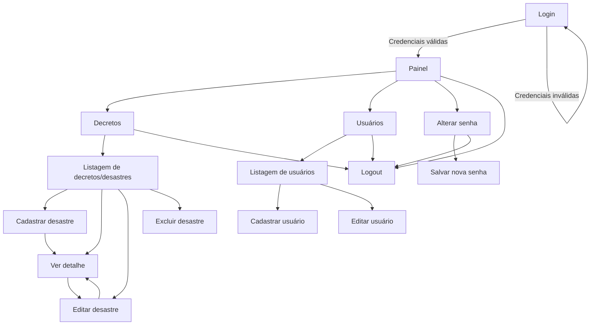
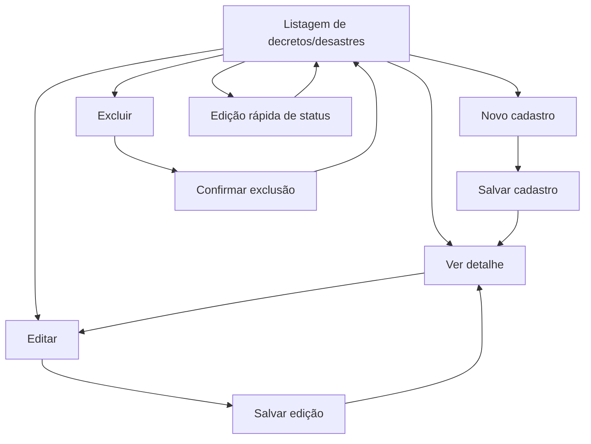

# 02 — DOCUMENTO TÉCNICO
# MAPA COMPLETO DOS MÓDULOS, PÁGINAS E HIERARQUIA DE NAVEGAÇÃO DO SISTEMA DGD

**Sistema:** DGD — Sistema de Gerenciamento de Desastres  
**Órgão gestor:** Coordenadoria Estadual de Defesa Civil do Estado do Pará — CEDEC-PA  
**Público-alvo:** Defesa Civil do Pará  
**Tipo de documento:** Mapa completo dos módulos, páginas e hierarquia de navegação  
**Versão:** 1.0  
**Formato:** Markdown  
**Status:** Especificação inicial para organização das telas, rotas e circulação do usuário  

---

## 1. Finalidade do documento

Este documento define o mapa completo dos módulos, páginas, subpáginas, rotas, menus, hierarquia de navegação, distribuição dos elementos de interface e lógica de circulação do usuário no **DGD — Sistema de Gerenciamento de Desastres**.

O objetivo é estabelecer uma estrutura clara para desenvolvimento das telas do sistema, mantendo padronização visual e operacional compatível com sistemas administrativos utilizados pela Defesa Civil, com referência estrutural no padrão do sistema **PLANCON**: menu objetivo, formulários segmentados, filtros superiores, listagens paginadas, ações por perfil, telas limpas e linguagem institucional.

Este documento não define a matriz completa de permissões. A matriz detalhada será tratada no **Documento 03 — Perfis de Usuário e Matriz de Permissões do Sistema**.

---

## 2. Escopo de navegação da versão inicial

A versão inicial do DGD será composta por uma página pública e quatro áreas autenticadas principais.

```text
DGD
├── Área pública
│   └── Login
└── Área autenticada
    ├── Painel
    ├── Decretos
    ├── Usuários
    └── Alterar senha
```

### 2.1 Páginas previstas

| Ordem | Página | Tipo | Finalidade |
|---:|---|---|---|
| 1 | Login | Pública | Autenticar usuários autorizados. |
| 2 | Painel | Autenticada | Exibir visão consolidada dos registros e pendências. |
| 3 | Decretos | Autenticada | Cadastrar, listar, editar, detalhar e excluir registros de desastre/decreto. |
| 4 | Usuários | Autenticada | Gerenciar usuários do sistema. |
| 5 | Alterar senha | Autenticada | Permitir troca de senha pelo usuário autenticado. |

---

## 3. Princípios de organização da navegação

A navegação do DGD deve seguir os seguintes princípios:

1. **Simplicidade operacional:** o usuário deve localizar rapidamente o módulo Decretos, pois ele é o núcleo do sistema.
2. **Baixa profundidade de navegação:** evitar muitos níveis internos. O ideal é que qualquer ação principal esteja a no máximo três cliques após o login.
3. **Padronização visual:** todas as telas autenticadas devem possuir cabeçalho, menu, breadcrumb, área de conteúdo, mensagens de sistema e ações bem posicionadas.
4. **Separação entre consulta e alteração:** páginas de detalhe devem ser prioritariamente de leitura; edição deve ocorrer em formulário próprio.
5. **Ações protegidas por perfil:** editar, excluir e gerenciar usuários devem depender do perfil do usuário.
6. **Listagens como ponto de partida:** o usuário deve iniciar o trabalho em listagens filtráveis e, a partir delas, acessar detalhes, edição ou cadastro.
7. **Rastreabilidade operacional:** toda ação sensível deve ser identificável, especialmente alterações de status, edição de registros e exclusões.
8. **Compatibilidade com ambiente PHP:** a estrutura de rotas deve ser simples, compatível com PHP, JavaScript, CSS, HTML, MySQL e administração por phpMyAdmin.

---

## 4. Hierarquia global de navegação

### 4.1 Estrutura textual completa

```text
DGD — Sistema de Gerenciamento de Desastres
│
├── 1. Login
│   ├── Formulário de autenticação
│   ├── Validação de credenciais
│   ├── Mensagem de erro
│   └── Redirecionamento para Painel
│
└── 2. Área autenticada
    │
    ├── 2.1 Painel
    │   ├── Cards de indicadores
    │   ├── Filtros rápidos
    │   ├── Pendências PGE
    │   ├── Pendências de homologação
    │   ├── Pendências de reconhecimento
    │   ├── Desastres recentes
    │   └── Atalhos operacionais
    │
    ├── 2.2 Decretos
    │   ├── Listagem de decretos/desastres
    │   │   ├── Filtros
    │   │   ├── Tabela paginada
    │   │   ├── Edição rápida de status
    │   │   ├── Ação: ver detalhe
    │   │   ├── Ação: editar
    │   │   └── Ação: excluir
    │   │
    │   ├── Cadastro de desastre
    │   │   ├── Identificação do registro
    │   │   ├── Município e UBM atuante
    │   │   ├── Decreto municipal
    │   │   ├── Classificação COBRADE
    │   │   ├── Homologação estadual
    │   │   ├── Reconhecimento federal
    │   │   ├── Tramitação PAE/PGE
    │   │   ├── Recursos de resposta
    │   │   ├── Recursos de reconstrução
    │   │   ├── Danos humanos e afetados
    │   │   └── Anexos
    │   │
    │   ├── Edição de desastre
    │   │   ├── Campos editáveis conforme perfil
    │   │   ├── Reprocessamento de campos automáticos
    │   │   └── Registro de atualização
    │   │
    │   ├── Detalhe do desastre
    │   │   ├── Resumo do protocolo DGD
    │   │   ├── Dados administrativos
    │   │   ├── Dados COBRADE
    │   │   ├── Situação de homologação
    │   │   ├── Situação de reconhecimento
    │   │   ├── Controle PGE
    │   │   ├── Recursos
    │   │   ├── Afetados
    │   │   ├── Anexos
    │   │   └── Histórico básico
    │   │
    │   └── Exclusão controlada
    │       ├── Confirmação de exclusão
    │       ├── Validação de perfil
    │       └── Exclusão lógica recomendada
    │
    ├── 2.3 Usuários
    │   ├── Listagem de usuários
    │   ├── Cadastro de usuário
    │   ├── Edição de usuário
    │   ├── Ativação/inativação
    │   └── Redefinição administrativa de senha
    │
    └── 2.4 Alterar senha
        ├── Senha atual
        ├── Nova senha
        ├── Confirmação da nova senha
        └── Gravação da alteração
```

### 4.2 Diagrama geral de navegação



---

## 5. Estrutura de menu

### 5.1 Menu da área pública

A área pública não deve ter menu administrativo. A tela pública deve apresentar apenas:

1. Identidade visual do DGD/CEDEC-PA.
2. Formulário de login.
3. Mensagem institucional curta.
4. Informação de acesso restrito.

### 5.2 Menu da área autenticada

O menu da área autenticada deve ser fixo e simples.

```text
Menu principal
├── Painel
├── Decretos
├── Usuários
├── Alterar senha
└── Sair
```

### 5.3 Visibilidade preliminar por perfil

A visibilidade exata será consolidada no Documento 03. Para o desenho de navegação, recomenda-se a seguinte organização preliminar:

| Item do menu | Admin | Gestor | Operador | Observação |
|---|:---:|:---:|:---:|---|
| Painel | Sim | Sim | Sim | Tela inicial após login. |
| Decretos | Sim | Sim | Sim | Módulo central do sistema. |
| Usuários | Sim | Não recomendado | Não | Gestão de contas deve ser restrita. |
| Alterar senha | Sim | Sim | Sim | Acesso individual. |
| Sair | Sim | Sim | Sim | Encerramento de sessão. |

**Decisão recomendada:** manter o menu **Usuários** visível apenas para o perfil **Admin**. Caso o perfil Gestor precise administrar operadores, isso deve ser explicitado na matriz de permissões do Documento 03.

---

## 6. Estrutura padrão das telas autenticadas

Todas as páginas internas devem seguir um padrão visual único.

```text
┌─────────────────────────────────────────────────────────────┐
│ Cabeçalho institucional                                      │
│ DGD | usuário logado | perfil | sair                         │
├───────────────┬─────────────────────────────────────────────┤
│ Menu lateral  │ Breadcrumb                                  │
│               ├─────────────────────────────────────────────┤
│ Painel        │ Título da página                Ação primária│
│ Decretos      ├─────────────────────────────────────────────┤
│ Usuários      │ Mensagens de sistema                         │
│ Alterar senha │ Filtros / formulário / tabela / detalhe      │
│ Sair          │ Paginação / botões de ação                   │
└───────────────┴─────────────────────────────────────────────┘
```

### 6.1 Elementos fixos

| Elemento | Localização | Finalidade |
|---|---|---|
| Cabeçalho institucional | Topo | Identificar sistema, órgão e usuário logado. |
| Menu principal | Lateral ou superior | Permitir circulação entre módulos. |
| Breadcrumb | Acima do conteúdo | Mostrar posição atual na navegação. |
| Título da página | Início da área de conteúdo | Informar contexto da tela. |
| Ação primária | Canto superior direito do conteúdo | Executar ação principal da página. |
| Mensagens do sistema | Abaixo do título | Exibir sucesso, erro, alerta ou validação. |
| Área de conteúdo | Centro | Exibir tabela, formulário, detalhe ou indicadores. |
| Rodapé técnico | Inferior | Exibir versão do sistema e identificação institucional. |

### 6.2 Padrão de breadcrumbs

Exemplos:

```text
Painel
Decretos > Listagem
Decretos > Novo cadastro
Decretos > Detalhe > DGD-2026-000001-20260115-ALTAMIRA
Decretos > Editar > DGD-2026-000001-20260115-ALTAMIRA
Usuários > Listagem
Usuários > Novo usuário
Usuários > Editar usuário
Alterar senha
```

---

## 7. Mapa de rotas recomendado

As rotas abaixo são recomendações para organização em PHP. Podem ser implementadas por arquivo físico, controlador MVC ou roteador simples.

### 7.1 Rotas públicas

| Método | Rota | Página | Finalidade |
|---|---|---|---|
| GET | `/login` | Login | Exibir formulário de autenticação. |
| POST | `/login` | Login | Processar autenticação. |

### 7.2 Rotas autenticadas principais

| Método | Rota | Página | Finalidade |
|---|---|---|---|
| GET | `/painel` | Painel | Exibir painel inicial. |
| GET | `/logout` | Sair | Encerrar sessão. |
| GET | `/alterar-senha` | Alterar senha | Exibir formulário de alteração de senha. |
| POST | `/alterar-senha` | Alterar senha | Salvar nova senha. |

### 7.3 Rotas do módulo Decretos

| Método | Rota | Página | Finalidade |
|---|---|---|---|
| GET | `/decretos` | Listagem | Listar registros com filtros e paginação. |
| GET | `/decretos/novo` | Cadastro | Exibir formulário de cadastro de desastre. |
| POST | `/decretos/salvar` | Cadastro | Salvar novo desastre/decreto. |
| GET | `/decretos/detalhe/{id}` | Detalhe | Visualizar detalhes do registro. |
| GET | `/decretos/editar/{id}` | Edição | Exibir formulário de edição. |
| POST | `/decretos/atualizar/{id}` | Edição | Salvar alterações. |
| POST | `/decretos/excluir/{id}` | Exclusão | Executar exclusão controlada. |
| POST | `/decretos/status/{id}` | Edição rápida | Atualizar status editáveis na listagem. |
| POST | `/decretos/anexos/{id}` | Anexos | Enviar documento anexo. |
| POST | `/decretos/anexos/remover/{id}` | Anexos | Remover ou inativar documento anexo. |

### 7.4 Rotas do módulo Usuários

| Método | Rota | Página | Finalidade |
|---|---|---|---|
| GET | `/usuarios` | Listagem | Listar usuários. |
| GET | `/usuarios/novo` | Cadastro | Exibir formulário de novo usuário. |
| POST | `/usuarios/salvar` | Cadastro | Salvar novo usuário. |
| GET | `/usuarios/editar/{id}` | Edição | Exibir formulário de edição. |
| POST | `/usuarios/atualizar/{id}` | Edição | Salvar alterações. |
| POST | `/usuarios/inativar/{id}` | Ativação/inativação | Inativar usuário. |
| POST | `/usuarios/ativar/{id}` | Ativação/inativação | Ativar usuário. |
| POST | `/usuarios/redefinir-senha/{id}` | Senha administrativa | Gerar ou redefinir senha temporária. |

---

## 8. Página pública — Login

### 8.1 Finalidade

Permitir que somente usuários autorizados acessem o DGD.

### 8.2 Elementos da interface

| Área | Elementos |
|---|---|
| Identificação | Nome do sistema, sigla DGD, identificação CEDEC-PA. |
| Formulário | Campo usuário/e-mail, campo senha, botão entrar. |
| Mensagens | Credenciais inválidas, usuário inativo, sessão expirada. |
| Rodapé | Versão do sistema, ambiente quando aplicável. |

### 8.3 Fluxo do usuário

```text
Usuário acessa o sistema
        ↓
Sistema exibe tela de login
        ↓
Usuário informa credenciais
        ↓
Sistema valida usuário, senha, perfil e situação
        ↓
Credenciais válidas?
        ├── Sim → redireciona para Painel
        └── Não → retorna para Login com mensagem de erro
```

### 8.4 Regras de navegação

1. Usuário não autenticado deve ser redirecionado para `/login`.
2. Usuário autenticado não deve permanecer na tela de login; ao acessar `/login`, deve ser redirecionado para `/painel`.
3. A tela de login não deve expor dados internos do sistema.
4. A mensagem de erro deve ser genérica, evitando indicar se o problema foi usuário inexistente ou senha incorreta.

---

## 9. Página autenticada — Painel

### 9.1 Finalidade

O Painel é a página inicial da área autenticada. Ele deve apresentar visão sintética dos registros de desastre/decreto, pendências administrativas e indicadores de acompanhamento.

### 9.2 Estrutura da tela

```text
Painel
├── Filtros rápidos
├── Cards de indicadores
├── Bloco de pendências
├── Bloco de registros recentes
└── Atalhos operacionais
```

### 9.3 Filtros rápidos

Filtros sugeridos:

1. Ano.
2. Município.
3. Tipo de decreto.
4. Tipo de desastre.
5. Homologação.
6. Reconhecimento.
7. Status PGE.
8. Analista.

### 9.4 Indicadores recomendados

| Indicador | Descrição |
|---|---|
| Total de desastres cadastrados | Quantidade de registros no período filtrado. |
| Total de decretos municipais | Registros com número de decreto municipal informado. |
| Homologações solicitadas | Registros com homologação marcada como solicitada. |
| Homologados | Registros com homologação concluída como homologado. |
| Não homologados | Registros com homologação concluída como não homologado. |
| Reconhecimentos solicitados | Registros com solicitação de reconhecimento federal. |
| Reconhecidos | Registros com reconhecimento deferido. |
| Pendentes PGE | Registros com status PGE pendente. |
| No prazo PGE | Registros com status PGE no prazo. |
| Total de afetados | Soma dos afetados dos registros filtrados. |

### 9.5 Pendências do Painel

O Painel deve destacar:

1. Registros com homologação pendente.
2. Registros enviados à PGE com prazo superior a 7 dias, conforme regra operacional informada.
3. Registros sem protocolo PAE/PGE quando o envio à PGE for necessário.
4. Registros sem analista atribuído.
5. Registros sem anexos obrigatórios.
6. Registros com reconhecimento em análise ou aguardando ajuste.

### 9.6 Atalhos operacionais

| Atalho | Destino |
|---|---|
| Novo cadastro de desastre | `/decretos/novo` |
| Ver decretos pendentes | `/decretos?status_pge=PENDENTE` |
| Ver homologações pendentes | `/decretos?homologacao=pendente` |
| Ver registros recentes | `/decretos?ordem=recentes` |

### 9.7 Fluxo do Painel

```text
Login bem-sucedido
        ↓
Painel carrega indicadores do ano corrente
        ↓
Usuário aplica filtro, se necessário
        ↓
Usuário acessa detalhe ou listagem filtrada
        ↓
Sistema direciona para o módulo Decretos
```

---

## 10. Módulo Decretos

### 10.1 Finalidade

O módulo **Decretos** é o núcleo funcional do DGD. Ele concentra o cadastro e gerenciamento de registros de desastre, decreto municipal, homologação estadual, reconhecimento federal, PGE, recursos, afetados e anexos.

Embora o nome do módulo seja “Decretos”, a navegação deve deixar claro que cada registro representa um **cadastro de desastre vinculado a um decreto municipal e seus desdobramentos administrativos**.

### 10.2 Subpáginas do módulo

```text
Decretos
├── Listagem
├── Cadastro
├── Detalhe
├── Edição
└── Exclusão controlada
```

### 10.3 Fluxo geral do módulo



---

## 11. Decretos — Listagem

### 11.1 Finalidade

Permitir consulta, filtragem, acompanhamento e acesso às ações principais dos registros de desastre/decreto.

### 11.2 Estrutura da tela

```text
Decretos > Listagem
├── Título: Decretos
├── Botão: Novo cadastro
├── Filtros
├── Tabela de registros
├── Ações por linha
└── Paginação
```

### 11.3 Filtros da listagem

Filtros recomendados:

| Filtro | Tipo de campo | Observação |
|---|---|---|
| Ano | Select ou campo numérico | Filtra pelo ano do protocolo ou data do desastre. |
| Protocolo DGD | Texto | Busca parcial ou exata. |
| Município | Select pesquisável | Lista de municípios do Pará. |
| UBM atuante | Select | Unidade atuante cadastrada. |
| Tipo de decreto | Select | Situação de Emergência ou Estado de Calamidade Pública. |
| Grupo COBRADE | Select | Primeiro nível da classificação. |
| Subgrupo COBRADE | Select dependente | Depende do grupo. |
| Tipo COBRADE | Select dependente | Depende do subgrupo. |
| Subtipo COBRADE | Select dependente | Depende do tipo. |
| Homologação | Select | Filtra por status de homologação. |
| Reconhecimento | Select | Filtra por status de reconhecimento. |
| Status PGE | Select | Filtra por aprovado, no prazo ou pendente. |
| Analista | Select | Lista de usuários com perfil Gestor. |
| Data do desastre inicial | Data | Início do intervalo. |
| Data do desastre final | Data | Fim do intervalo. |
| Data do decreto municipal inicial | Data | Início do intervalo. |
| Data do decreto municipal final | Data | Fim do intervalo. |

### 11.4 Ações dos filtros

| Ação | Comportamento |
|---|---|
| Filtrar | Aplica os filtros informados. |
| Limpar filtros | Remove filtros e retorna à listagem padrão. |
| Novo cadastro | Abre tela de cadastro de desastre. |

### 11.5 Colunas da tabela

A listagem deve seguir a ordem operacional informada para o DGD.

| Ordem | Coluna | Tipo | Comportamento |
|---:|---|---|---|
| 1 | Ordem sequencial por ano | Número | Sequência visual da listagem por ano. |
| 2 | Protocolo DGD | Texto | Link para detalhe do registro. |
| 3 | Município | Texto | Município afetado. |
| 4 | Tipo de desastre | Texto | Exibir tipo/subtipo COBRADE ou descrição resumida. |
| 5 | Data do decreto municipal | Data | Formato `dd/mm/aaaa`. |
| 6 | Total de dias do decreto | Número | Campo calculado conforme regra de vigência definida. |
| 7 | Homologação | Select/status | Editável conforme perfil autorizado. |
| 8 | Reconhecimento | Select/status | Editável conforme perfil autorizado. |
| 9 | Total de afetados | Número | Soma automática dos afetados. |
| 10 | Total de dias para a PGE | Número | Campo calculado para controle do prazo. |
| 11 | Status de envio à PGE | Select/status | Editável conforme perfil autorizado. |
| 12 | Analista | Texto/select | Usuário com perfil Gestor vinculado ao registro. |
| 13 | Número do decreto municipal | Texto | Número informado no cadastro. |
| 14 | Ações | Botões | Ver detalhe, editar, excluir. |

### 11.6 Paginação

A listagem deve possuir paginação com limite máximo de **20 registros por página**.

```text
Registros por página: 20
Ordenação padrão: ano decrescente + sequência decrescente ou data de cadastro decrescente
```

### 11.7 Ações por linha

| Ação | Ícone sugerido | Perfis recomendados | Comportamento |
|---|---|---|---|
| Ver detalhe | Visualizar | Admin, Gestor, Operador | Abre página de detalhe em modo leitura. |
| Editar | Editar | Admin, Gestor | Abre formulário de edição. |
| Excluir | Excluir | Admin, Gestor | Abre confirmação de exclusão. |

### 11.8 Edição rápida de status

A listagem pode permitir edição rápida dos seguintes campos:

1. Homologação.
2. Reconhecimento.
3. Status de envio à PGE.
4. Analista, caso autorizado.

**Ponto de atenção técnico:** recomenda-se separar o **status de envio à PGE**, que pode ser manual/editável, do **status de prazo PGE**, que é calculado automaticamente. Usar um único campo para as duas finalidades pode gerar inconsistência, pois uma regra automática pode sobrescrever uma informação operacional informada pelo usuário.

### 11.9 Estado vazio

Quando não houver registros, a tela deve exibir:

```text
Nenhum registro encontrado para os filtros informados.
```

Se o usuário tiver permissão de cadastro, deve aparecer o botão:

```text
Cadastrar primeiro desastre
```

---

## 12. Decretos — Cadastro de desastre

### 12.1 Finalidade

Registrar um novo desastre/decreto no DGD, gerando protocolo automático e reunindo informações administrativas, técnicas, processuais e documentais.

### 12.2 Estrutura do formulário

O formulário deve ser dividido em blocos para reduzir erro de preenchimento.

```text
Cadastro de desastre
├── 1. Identificação do registro
├── 2. Dados territoriais e institucionais
├── 3. Classificação COBRADE
├── 4. Decreto municipal
├── 5. Homologação estadual
├── 6. Reconhecimento federal
├── 7. Tramitação PAE/PGE
├── 8. Recursos de ação de resposta
├── 9. Recursos de ação de reconstrução
├── 10. Danos humanos e afetados
└── 11. Anexos
```

### 12.3 Bloco 1 — Identificação do registro

| Campo | Tipo | Comportamento |
|---|---|---|
| Protocolo DGD | Automático | Gerado após salvar ou exibido como prévia. |
| Ano do protocolo | Automático | Derivado da data do desastre ou data de cadastro, conforme regra definida. |
| Sequencial anual | Automático | Reinicia a cada ano. |
| Data do cadastro | Automático | Data/hora de criação do registro. |
| Usuário cadastrador | Automático | Usuário autenticado. |

### 12.4 Padrão do protocolo DGD

Padrão recomendado:

```text
DGD-AAAA-000001-AAAAMMDD-MUNICIPIO
```

Exemplo:

```text
DGD-2026-000001-20260115-ALTAMIRA
```

Composição:

| Parte | Significado |
|---|---|
| DGD | Sigla fixa do sistema. |
| AAAA | Ano de referência. |
| 000001 | Sequencial anual. |
| AAAAMMDD | Data do desastre. |
| MUNICIPIO | Nome do município normalizado, sem acentos e espaços. |

### 12.5 Bloco 2 — Dados territoriais e institucionais

| Campo | Tipo | Obrigatoriedade sugerida |
|---|---|---|
| Município | Select pesquisável | Obrigatório |
| UBM atuante | Select | Obrigatório ou recomendado |
| Tipo de decreto | Select | Obrigatório |
| Data do desastre | Data | Obrigatório |
| Protocolo S2ID | Texto | Opcional no cadastro inicial |

Valores de **tipo de decreto**:

1. Situação de Emergência.
2. Estado de Calamidade Pública.

### 12.6 Bloco 3 — Classificação COBRADE

| Campo | Tipo | Comportamento |
|---|---|---|
| Grupo COBRADE | Select | Carrega os grupos disponíveis. |
| Subgrupo COBRADE | Select dependente | Filtra conforme grupo selecionado. |
| Tipo COBRADE | Select dependente | Filtra conforme subgrupo selecionado. |
| Subtipo COBRADE | Select dependente | Filtra conforme tipo selecionado. |
| Descrição COBRADE | Texto automático | Exibe descrição do código selecionado. |
| Simbologia | Imagem/ícone | Exibe símbolo associado ao tipo de desastre. |

A estrutura COBRADE deve seguir o modelo já utilizado no sistema PLANCON, aproveitando a base de dados desenvolvida anteriormente quando disponível.

### 12.7 Bloco 4 — Decreto municipal

| Campo | Tipo | Obrigatoriedade sugerida |
|---|---|---|
| Número do decreto municipal | Texto | Obrigatório quando houver decreto publicado. |
| Data do decreto municipal | Data | Obrigatório quando houver decreto publicado. |
| Total de dias do decreto | Automático | Calculado pelo sistema. |

**Ponto de atenção:** para gestão real de vigência, o sistema deve possuir regra objetiva para calcular o total de dias do decreto. Se a base inicial tiver apenas a data do decreto municipal, o cálculo poderá indicar dias transcorridos desde a publicação. Para controle de vencimento de vigência, recomenda-se incluir futuramente data final de vigência ou regra parametrizada por tipo de decreto.

### 12.8 Bloco 5 — Homologação estadual

| Campo | Tipo |
|---|---|
| Número do decreto estadual de homologação | Texto |
| Data do decreto de homologação | Data |
| Homologação | Select/status |

Valores de **homologação**:

1. Solicitado.
2. Não solicitado.
3. Pendente — despacho.
4. Pendente — parecer.
5. Em análise DGD.
6. Enviado PGE.
7. Homologado.
8. Não homologado.
9. Não registrado.

### 12.9 Bloco 6 — Reconhecimento federal

| Campo | Tipo |
|---|---|
| Reconhecimento | Select/status |

Valores de **reconhecimento**:

1. Solicitado.
2. Reconhecido.
3. Em análise SEDEC.
4. Enviado para reconhecimento.
5. Aguardando ajuste município.
6. Não reconhecido.
7. Aguardando análise.
8. Registrado.
9. Não registrado.

### 12.10 Bloco 7 — Tramitação PAE/PGE

| Campo | Tipo | Comportamento |
|---|---|---|
| Protocolo PAE/PGE | Texto | Número do processo/protocolo. |
| Data de envio para PGE | Data | Base para cálculo do prazo. |
| Analista | Select | Lista de usuários com perfil Gestor. |
| Total de dias para a PGE | Automático | Calculado a partir da data de envio à PGE. |
| Status de envio à PGE | Select/status | Informação operacional editável. |
| Status de prazo PGE | Automático | Resultado da regra de prazo. |

### 12.11 Regra de status de prazo PGE

A regra operacional informada deve ser aplicada da seguinte forma:

```text
SE Homologação = Homologado
    Status de prazo PGE = APROVADO
SENÃO SE Total de dias para PGE <= 7 E Total de dias para PGE > 0
    Status de prazo PGE = NO PRAZO
SENÃO SE Total de dias para PGE > 7
    Status de prazo PGE = PENDENTE
SENÃO
    Status de prazo PGE = NÃO REGISTRADO
```

Representação equivalente da regra original:

```text
IFS(
    [HOMOLOGACAO] = 'Homologado', 'APROVADO',
    AND([DURACAO_PGE_DIAS] <= 7, [DURACAO_PGE_DIAS] > 0), 'NO PRAZO',
    [DURACAO_PGE_DIAS] > 7, 'PENDENTE'
)
```

### 12.12 Bloco 8 — Recursos de ação de resposta

| Campo | Tipo |
|---|---|
| Recursos de ação de resposta | Select/status |

Valores:

1. Solicitado.
2. Plano aprovado.
3. Recurso deferido.
4. Recurso indeferido.
5. Aguardando ajustes.
6. Em análise SEDEC.
7. Registro de revisão.
8. Empenho.
9. Não solicitado.
10. Não registrado.

### 12.13 Bloco 9 — Recursos de ação de reconstrução

| Campo | Tipo |
|---|---|
| Recursos de ação de reconstrução | Select/status |

Valores:

1. Solicitado.
2. Plano aprovado.
3. Recurso deferido.
4. Recurso indeferido.
5. Aguardando ajustes.
6. Em análise SEDEC.
7. Registro de revisão.
8. Empenho.
9. Não solicitado.
10. Não registrado.

### 12.14 Bloco 10 — Danos humanos e afetados

| Campo | Tipo | Comportamento |
|---|---|---|
| Número de óbitos | Inteiro | Valor igual ou superior a zero. |
| Número de feridos | Inteiro | Valor igual ou superior a zero. |
| Número de enfermos | Inteiro | Valor igual ou superior a zero. |
| Número de desabrigados | Inteiro | Valor igual ou superior a zero. |
| Número de desalojados | Inteiro | Valor igual ou superior a zero. |
| Número de outros afetados | Inteiro | Valor igual ou superior a zero. |
| Total de afetados | Automático | Soma dos campos numéricos. |

Regra:

```text
TOTAL_AFETADOS = OBITOS + FERIDOS + ENFERMOS + DESABRIGADOS + DESALOJADOS + OUTROS_AFETADOS
```

### 12.15 Bloco 11 — Anexos

Categorias de anexos:

1. Decreto municipal.
2. Ofício de homologação.
3. Parecer estadual.
4. Parecer municipal.
5. Outros documentos.

Campos por anexo:

| Campo | Tipo |
|---|---|
| Tipo do anexo | Select |
| Arquivo | Upload |
| Descrição | Texto curto |
| Data de envio | Automático |
| Usuário responsável | Automático |

### 12.16 Ações do formulário de cadastro

| Ação | Comportamento |
|---|---|
| Salvar | Valida e grava o registro. |
| Salvar e continuar editando | Grava e mantém o usuário na tela de edição. |
| Cancelar | Retorna para listagem sem salvar. |
| Limpar formulário | Remove dados ainda não salvos. |

### 12.17 Fluxo de cadastro

```text
Usuário acessa Decretos
        ↓
Clica em Novo cadastro
        ↓
Sistema exibe formulário segmentado
        ↓
Usuário preenche os dados obrigatórios
        ↓
Sistema valida campos
        ↓
Sistema gera protocolo DGD
        ↓
Sistema calcula total de afetados e status automáticos
        ↓
Registro é salvo
        ↓
Usuário é redirecionado para Detalhe do desastre
```

---

## 13. Decretos — Edição

### 13.1 Finalidade

Permitir atualização controlada de registros existentes.

### 13.2 Acesso

A edição deve ser disponibilizada preferencialmente aos perfis:

1. Admin.
2. Gestor.

O perfil Operador pode ter edição limitada se a matriz de permissões assim definir no Documento 03.

### 13.3 Estrutura da tela

A tela de edição deve reaproveitar a estrutura do cadastro, com os campos preenchidos e com o protocolo DGD em modo somente leitura.

```text
Editar desastre
├── Protocolo DGD bloqueado
├── Blocos de dados editáveis
├── Reprocessamento dos campos automáticos
├── Botão salvar alterações
└── Botão cancelar
```

### 13.4 Campos que não devem ser alterados livremente

| Campo | Regra recomendada |
|---|---|
| Protocolo DGD | Não editável. |
| Sequencial anual | Não editável. |
| Usuário cadastrador | Não editável. |
| Data de cadastro | Não editável. |
| Histórico de anexos | Não apagar fisicamente; inativar quando necessário. |

### 13.5 Reprocessamentos automáticos na edição

Ao salvar alterações, o sistema deve recalcular:

1. Total de afetados.
2. Total de dias para a PGE.
3. Status de prazo PGE.
4. Total de dias do decreto, conforme regra definida.
5. Descrição e simbologia COBRADE, quando houver alteração do código COBRADE.

### 13.6 Fluxo de edição

```text
Usuário acessa listagem ou detalhe
        ↓
Clica em Editar
        ↓
Sistema valida permissão
        ↓
Sistema exibe formulário preenchido
        ↓
Usuário altera dados permitidos
        ↓
Sistema valida campos
        ↓
Sistema recalcula campos automáticos
        ↓
Sistema grava alterações
        ↓
Usuário retorna para Detalhe do desastre
```

---

## 14. Decretos — Detalhe do desastre

### 14.1 Finalidade

Apresentar uma visão completa, organizada e preferencialmente somente leitura do registro de desastre/decreto.

### 14.2 Estrutura da tela

```text
Detalhe do desastre
├── Cabeçalho do registro
├── Resumo executivo
├── Dados territoriais
├── Classificação COBRADE
├── Dados do decreto municipal
├── Homologação estadual
├── Reconhecimento federal
├── Tramitação PAE/PGE
├── Recursos de resposta
├── Recursos de reconstrução
├── Danos humanos e afetados
├── Anexos
└── Histórico básico
```

### 14.3 Cabeçalho do registro

Elementos recomendados:

1. Protocolo DGD.
2. Município.
3. Tipo de decreto.
4. Tipo de desastre.
5. Data do desastre.
6. Status de homologação.
7. Status de reconhecimento.
8. Status de prazo PGE.

### 14.4 Ações disponíveis no detalhe

| Ação | Perfis recomendados | Comportamento |
|---|---|---|
| Voltar para listagem | Admin, Gestor, Operador | Retorna para `/decretos`. |
| Editar | Admin, Gestor | Abre tela de edição. |
| Excluir | Admin, Gestor | Abre confirmação de exclusão. |
| Adicionar anexo | Admin, Gestor | Abre componente de upload. |
| Visualizar anexo | Admin, Gestor, Operador | Abre ou baixa documento. |

### 14.5 Histórico básico

O detalhe deve exibir um histórico mínimo com:

1. Data/hora da criação.
2. Usuário que criou o registro.
3. Data/hora da última alteração.
4. Usuário da última alteração.
5. Alterações relevantes de status, quando implementado.

---

## 15. Decretos — Exclusão controlada

### 15.1 Finalidade

Permitir retirada controlada de registros quando houver erro de cadastro ou duplicidade.

### 15.2 Regra recomendada

A exclusão deve ser **lógica**, não física.

```text
Registro excluído logicamente = permanece no banco, mas deixa de aparecer na listagem padrão.
```

Campos sugeridos para controle:

1. `excluido`.
2. `data_exclusao`.
3. `usuario_exclusao`.
4. `motivo_exclusao`.

### 15.3 Fluxo de exclusão

```text
Usuário clica em Excluir
        ↓
Sistema valida perfil
        ↓
Sistema exibe modal de confirmação
        ↓
Usuário informa ou confirma motivo
        ↓
Sistema marca registro como excluído
        ↓
Sistema retorna para listagem
```

### 15.4 Mensagem de confirmação

```text
Deseja realmente excluir este registro?
Esta ação removerá o item da listagem padrão, mas manterá o histórico no sistema.
```

---

## 16. Módulo Usuários

### 16.1 Finalidade

Permitir a administração dos usuários autorizados a acessar o DGD.

### 16.2 Subpáginas

```text
Usuários
├── Listagem
├── Cadastro
├── Edição
├── Ativação/inativação
└── Redefinição administrativa de senha
```

### 16.3 Listagem de usuários

Colunas recomendadas:

| Coluna | Descrição |
|---|---|
| Nome | Nome completo do usuário. |
| E-mail/login | Identificador de acesso. |
| Perfil | Admin, Gestor ou Operador. |
| Situação | Ativo ou inativo. |
| Data de cadastro | Data de criação do usuário. |
| Último acesso | Última autenticação, se registrada. |
| Ações | Editar, ativar/inativar, redefinir senha. |

### 16.4 Cadastro de usuário

Campos recomendados:

| Campo | Tipo | Obrigatoriedade sugerida |
|---|---|---|
| Nome completo | Texto | Obrigatório |
| E-mail/login | Texto | Obrigatório |
| Perfil | Select | Obrigatório |
| Situação | Select | Obrigatório |
| Senha inicial | Senha ou geração automática | Obrigatório |
| Confirmação de senha | Senha | Obrigatório quando senha manual |

Perfis disponíveis:

1. Admin.
2. Gestor.
3. Operador.

### 16.5 Edição de usuário

A edição deve permitir:

1. Alterar nome.
2. Alterar e-mail/login, se permitido.
3. Alterar perfil.
4. Ativar ou inativar usuário.
5. Redefinir senha.

### 16.6 Fluxo do módulo Usuários

```text
Admin acessa Usuários
        ↓
Sistema exibe listagem
        ↓
Admin cadastra ou edita usuário
        ↓
Sistema valida dados obrigatórios
        ↓
Sistema salva alteração
        ↓
Admin retorna para listagem
```

### 16.7 Restrição de navegação

Usuários sem permissão não devem visualizar o menu Usuários nem acessar suas rotas diretamente. Caso tentem acessar a URL, o sistema deve retornar mensagem de acesso negado ou redirecionar para o Painel.

---

## 17. Página Alterar senha

### 17.1 Finalidade

Permitir que o usuário autenticado altere sua própria senha.

### 17.2 Estrutura da tela

```text
Alterar senha
├── Senha atual
├── Nova senha
├── Confirmar nova senha
├── Botão salvar
└── Botão cancelar
```

### 17.3 Campos

| Campo | Tipo | Obrigatoriedade |
|---|---|---|
| Senha atual | Senha | Obrigatório |
| Nova senha | Senha | Obrigatório |
| Confirmar nova senha | Senha | Obrigatório |

### 17.4 Fluxo

```text
Usuário acessa Alterar senha
        ↓
Informa senha atual
        ↓
Informa nova senha
        ↓
Confirma nova senha
        ↓
Sistema valida senha atual e confirmação
        ↓
Sistema grava nova senha
        ↓
Sistema exibe mensagem de sucesso
```

### 17.5 Regras recomendadas

1. A nova senha não deve ser igual à senha atual.
2. A confirmação deve ser idêntica à nova senha.
3. A senha deve ser armazenada com hash seguro, nunca em texto puro.
4. Após troca de senha, o sistema pode manter a sessão ativa ou exigir novo login, conforme regra de segurança definida no Documento 03.

---

## 18. Lógica de circulação do usuário

### 18.1 Circulação principal

```text
Login → Painel → Decretos → Detalhe → Editar → Detalhe → Listagem
```

Esse deve ser o fluxo operacional padrão para o módulo principal.

### 18.2 Circulação para cadastro

```text
Login → Painel → Decretos → Novo cadastro → Salvar → Detalhe do desastre
```

Após salvar novo registro, recomenda-se redirecionar para o **Detalhe**, não para a listagem. Isso permite conferência imediata do protocolo DGD, dos dados calculados e dos anexos.

### 18.3 Circulação para consulta

```text
Login → Painel → Decretos → Filtros → Listagem → Detalhe → Voltar
```

### 18.4 Circulação para pendências PGE

```text
Login → Painel → Pendências PGE → Listagem filtrada → Detalhe ou edição
```

### 18.5 Circulação para gestão de usuários

```text
Login → Painel → Usuários → Listagem → Novo usuário ou Editar usuário → Listagem
```

### 18.6 Circulação para alteração de senha

```text
Login → Painel → Alterar senha → Salvar → Painel
```

---

## 19. Estados de tela e mensagens

### 19.1 Tipos de mensagem

| Tipo | Exemplo | Uso |
|---|---|---|
| Sucesso | Registro salvo com sucesso. | Após gravação. |
| Erro | Não foi possível salvar o registro. | Falha de banco, permissão ou validação. |
| Alerta | Existem campos obrigatórios não preenchidos. | Validação de formulário. |
| Informação | Nenhum registro encontrado. | Estado vazio. |
| Acesso negado | Você não possui permissão para acessar esta funcionalidade. | Controle por perfil. |

### 19.2 Mensagens recomendadas

| Situação | Mensagem |
|---|---|
| Login inválido | Usuário ou senha inválidos. |
| Usuário inativo | Usuário sem permissão de acesso. Procure o administrador do sistema. |
| Sessão expirada | Sua sessão expirou. Acesse novamente. |
| Cadastro salvo | Registro cadastrado com sucesso. |
| Edição salva | Registro atualizado com sucesso. |
| Exclusão concluída | Registro removido da listagem com sucesso. |
| Sem permissão | Você não possui permissão para executar esta ação. |
| Erro de upload | Não foi possível enviar o arquivo. Verifique o formato e o tamanho permitido. |

---

## 20. Componentes reutilizáveis de interface

Para manter padronização, o sistema deve reaproveitar componentes.

| Componente | Uso |
|---|---|
| Cabeçalho interno | Todas as páginas autenticadas. |
| Menu principal | Área autenticada. |
| Breadcrumb | Todas as páginas internas. |
| Card de indicador | Painel. |
| Bloco de filtros | Listagens. |
| Tabela paginada | Decretos e Usuários. |
| Botão de ação primária | Cadastro e principais ações. |
| Botão secundário | Cancelar, voltar, limpar. |
| Badge de status | Homologação, reconhecimento, PGE e recursos. |
| Select dependente | COBRADE. |
| Campo de upload | Anexos. |
| Modal de confirmação | Exclusão e ações críticas. |
| Mensagem de sistema | Sucesso, erro, alerta e informação. |

---

## 21. Padrão de botões

### 21.1 Botões principais

| Botão | Uso |
|---|---|
| Novo cadastro | Abrir cadastro de desastre. |
| Salvar | Gravar dados. |
| Salvar alterações | Gravar edição. |
| Filtrar | Aplicar busca. |
| Limpar filtros | Remover busca. |
| Voltar | Retornar à página anterior. |
| Editar | Abrir modo de edição. |
| Excluir | Acionar exclusão controlada. |
| Sair | Encerrar sessão. |

### 21.2 Regra de posicionamento

1. Ação primária no topo direito da área de conteúdo.
2. Ações de formulário no final da página.
3. Ações por linha no final da tabela.
4. Ação destrutiva, como excluir, separada visualmente das demais.

---

## 22. Padrão de status visuais

Status devem ser exibidos como texto e, quando possível, com marcador visual. A cor pode auxiliar, mas não deve ser a única forma de identificação.

### 22.1 Homologação

| Status | Uso |
|---|---|
| Solicitado | Homologação solicitada. |
| Não solicitado | Ainda não solicitada. |
| Pendente — despacho | Aguardando despacho. |
| Pendente — parecer | Aguardando parecer. |
| Em análise DGD | Em análise interna. |
| Enviado PGE | Processo enviado à PGE. |
| Homologado | Homologação concluída favoravelmente. |
| Não homologado | Homologação não aprovada. |
| Não registrado | Informação inexistente no cadastro. |

### 22.2 Reconhecimento

| Status | Uso |
|---|---|
| Solicitado | Reconhecimento solicitado. |
| Reconhecido | Reconhecimento concluído favoravelmente. |
| Em análise SEDEC | Em análise na esfera competente. |
| Enviado para reconhecimento | Enviado para análise. |
| Aguardando ajuste município | Dependente de correção municipal. |
| Não reconhecido | Reconhecimento não aprovado. |
| Aguardando análise | Aguardando análise. |
| Registrado | Informação registrada. |
| Não registrado | Informação inexistente no cadastro. |

### 22.3 PGE

| Status calculado | Regra |
|---|---|
| APROVADO | Homologação igual a Homologado. |
| NO PRAZO | Total de dias para PGE maior que 0 e menor ou igual a 7. |
| PENDENTE | Total de dias para PGE maior que 7. |
| NÃO REGISTRADO | Ausência de dados para cálculo. |

---

## 23. Regras de acesso e bloqueio de navegação

### 23.1 Usuário não autenticado

Se tentar acessar qualquer rota interna:

```text
/decretos
/painel
/usuarios
/alterar-senha
```

Deve ser redirecionado para:

```text
/login
```

### 23.2 Usuário autenticado sem permissão

Se tentar acessar funcionalidade não permitida:

```text
Sistema bloqueia acesso
        ↓
Exibe mensagem de acesso negado
        ↓
Redireciona para Painel ou página anterior
```

### 23.3 Sessão expirada

```text
Sessão expira
        ↓
Usuário tenta executar ação
        ↓
Sistema redireciona para Login
        ↓
Exibe mensagem: Sua sessão expirou. Acesse novamente.
```

---

## 24. Navegação responsiva

A versão inicial deve priorizar uso em computador, pois as atividades administrativas de decreto, homologação, PGE e anexos exigem leitura e preenchimento detalhado.

Mesmo assim, recomenda-se que as páginas sejam responsivas para acesso em notebooks, tablets e celulares.

### 24.1 Comportamento em telas menores

| Elemento | Comportamento recomendado |
|---|---|
| Menu lateral | Recolher em botão de menu. |
| Tabelas | Permitir rolagem horizontal. |
| Filtros | Empilhar em uma coluna. |
| Cards | Exibir em uma ou duas colunas. |
| Formulários | Exibir campos em uma coluna. |
| Ações por linha | Agrupar em botão de opções. |

---

## 25. Ordenação e busca

### 25.1 Ordenação padrão da listagem de Decretos

Recomendação:

```text
1. Ano do protocolo: decrescente
2. Sequencial anual: decrescente
```

Alternativa:

```text
Data de cadastro: decrescente
```

### 25.2 Busca textual

A busca textual deve consultar, no mínimo:

1. Protocolo DGD.
2. Município.
3. Número do decreto municipal.
4. Protocolo S2ID.
5. Protocolo PAE/PGE.
6. Analista.

---

## 26. Dependências entre campos na navegação

### 26.1 COBRADE

Os campos COBRADE devem funcionar em cascata:

```text
Grupo COBRADE
        ↓
Subgrupo COBRADE
        ↓
Tipo COBRADE
        ↓
Subtipo COBRADE
        ↓
Descrição e simbologia
```

Se o usuário alterar um nível superior, os níveis inferiores devem ser limpos e recarregados.

### 26.2 Total de afetados

O total de afetados deve ser atualizado automaticamente quando qualquer campo numérico de afetados for alterado.

```text
Óbitos
Feridos
Enfermos
Desabrigados
Desalojados
Outros afetados
        ↓
Total de afetados
```

### 26.3 Status PGE

O status de prazo PGE deve ser recalculado quando houver alteração em:

1. Homologação.
2. Data de envio para PGE.
3. Data-base de cálculo do prazo.

---

## 27. Ações críticas que exigem confirmação

As ações abaixo devem exigir confirmação explícita:

1. Excluir desastre/decreto.
2. Excluir ou remover anexo.
3. Inativar usuário.
4. Redefinir senha de usuário.
5. Alterar perfil de usuário.
6. Alterar homologação para Homologado ou Não homologado, se a regra administrativa exigir validação.
7. Alterar reconhecimento para Reconhecido ou Não reconhecido, se a regra administrativa exigir validação.

---

## 28. Fluxo de anexos

### 28.1 Upload de anexo

```text
Usuário acessa cadastro, edição ou detalhe
        ↓
Seleciona tipo de documento
        ↓
Seleciona arquivo
        ↓
Informa descrição opcional
        ↓
Sistema valida tipo e tamanho
        ↓
Sistema salva arquivo e metadados
        ↓
Anexo aparece na lista do registro
```

### 28.2 Tipos de anexos

| Tipo | Uso |
|---|---|
| Decreto municipal | Documento do município que declarou SE ou ECP. |
| Ofício de homologação | Solicitação ou comunicação relacionada à homologação. |
| Parecer estadual | Parecer técnico estadual. |
| Parecer municipal | Parecer ou documentação técnica municipal. |
| Outros documentos | Documentos complementares. |

### 28.3 Ponto de atenção

Anexos não devem ser sobrescritos sem controle. Se um documento for substituído, recomenda-se manter histórico ou registrar novo anexo, preservando rastreabilidade.

---

## 29. Mapa resumido de páginas e responsabilidades

| Página | Responsabilidade principal | Entrada | Saída esperada |
|---|---|---|---|
| Login | Autenticar usuário | Credenciais | Sessão autenticada ou erro. |
| Painel | Exibir visão geral | Filtros | Indicadores e atalhos. |
| Decretos — Listagem | Consultar registros | Filtros | Tabela paginada. |
| Decretos — Cadastro | Criar registro | Dados do desastre | Protocolo DGD e registro salvo. |
| Decretos — Detalhe | Consultar registro completo | ID do registro | Dados consolidados. |
| Decretos — Edição | Atualizar registro | ID e alterações | Registro atualizado. |
| Decretos — Exclusão | Remover da listagem | ID e confirmação | Exclusão lógica. |
| Usuários — Listagem | Consultar usuários | Filtros simples | Tabela de usuários. |
| Usuários — Cadastro | Criar usuário | Dados de acesso | Usuário ativo ou inativo. |
| Usuários — Edição | Atualizar usuário | ID e alterações | Usuário atualizado. |
| Alterar senha | Trocar senha própria | Senha atual e nova | Senha atualizada. |

---

## 30. Critérios de aceite do Documento 02

A estrutura de navegação será considerada aderente quando o sistema permitir:

1. Acessar tela pública de login sem expor dados internos.
2. Redirecionar usuário autenticado para o Painel.
3. Exibir menu autenticado com Painel, Decretos, Usuários, Alterar senha e Sair, conforme perfil.
4. Acessar listagem de Decretos com filtros superiores.
5. Exibir listagem de Decretos com paginação máxima de 20 registros.
6. Exibir as colunas operacionais definidas para a listagem de Decretos.
7. Acessar cadastro de desastre a partir da listagem ou do Painel.
8. Gerar protocolo DGD automático no cadastro.
9. Acessar detalhe do desastre em modo leitura.
10. Acessar edição apenas com perfil autorizado.
11. Executar exclusão somente com confirmação e perfil autorizado.
12. Controlar anexos por tipo documental.
13. Acessar página de usuários somente com perfil autorizado.
14. Permitir alteração de senha para todos os usuários autenticados.
15. Bloquear rotas internas para usuários não autenticados.

---

## 31. Pontos de atenção para os próximos documentos

Os seguintes pontos devem ser detalhados nos próximos documentos técnicos:

1. **Documento 03 — Perfis e permissões:** definir exatamente o que Admin, Gestor e Operador podem visualizar, cadastrar, editar, excluir e homologar.
2. **Documento 04 — Arquitetura MVC:** transformar as rotas deste documento em controllers, models, views, services e helpers.
3. **Documento 05 — Banco de dados:** criar tabelas para usuários, desastres, municípios, UBM, COBRADE, anexos, status e logs.
4. **Documento 06 — Dicionário de dados:** detalhar tipo, tamanho, obrigatoriedade, validações e origem de cada campo.
5. **Prompt Codex/Cortex:** converter esta especificação em comando técnico de desenvolvimento para geração assistida de código.

---

## 32. Decisões técnicas recomendadas

1. O módulo **Decretos** deve permanecer como item principal de navegação, mas internamente deve tratar o objeto como **desastre/decreto**.
2. O protocolo DGD deve ser imutável após a criação do registro.
3. O status de envio à PGE e o status de prazo PGE devem ser tratados como informações distintas.
4. A exclusão de registros deve ser lógica.
5. O módulo Usuários deve ser restrito ao perfil Admin na versão inicial.
6. A listagem de Decretos deve ser a principal tela operacional do sistema.
7. O Detalhe deve ser usado como tela de conferência após cadastro e edição.
8. Os formulários devem ser segmentados em blocos para reduzir erro operacional.
9. Os campos COBRADE devem ser dependentes e carregados em cascata.
10. O sistema deve priorizar clareza administrativa sobre excesso de elementos visuais.

---

## 33. Encerramento

Este documento estabelece o mapa de módulos, páginas e hierarquia de navegação do DGD. A estrutura proposta organiza o sistema em uma navegação curta, objetiva e compatível com a rotina administrativa da CEDEC-PA, mantendo o módulo Decretos como núcleo do gerenciamento de desastres.

A partir deste documento, o próximo passo é definir a matriz completa de acesso, estabelecendo quais perfis podem consultar, cadastrar, editar, excluir, atualizar status, gerenciar usuários e manipular anexos.

**Próximo documento da sequência:**  
**03 — DOCUMENTO TÉCNICO – PERFIS DE USUÁRIO E MATRIZ DE PERMISSÕES DO SISTEMA.**
