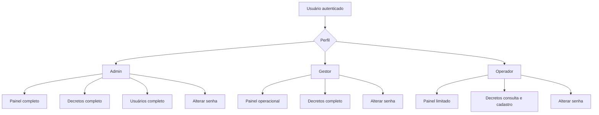

# 03 — DOCUMENTO TÉCNICO
# PERFIS DE USUÁRIO E MATRIZ DE PERMISSÕES DO SISTEMA DGD

**Sistema:** DGD — Sistema de Gerenciamento de Desastres  
**Órgão gestor:** Coordenadoria Estadual de Defesa Civil do Estado do Pará — CEDEC-PA  
**Público-alvo:** Defesa Civil do Pará  
**Tipo de documento:** Perfis de usuário e matriz de permissões do sistema  
**Versão:** 1.0  
**Formato:** Markdown  
**Status:** Especificação inicial para controle de acesso, regras de permissão e segurança operacional  

---

## 1. Finalidade do documento

Este documento define os **perfis de usuário**, as **responsabilidades operacionais**, os **níveis de acesso**, as **restrições por página**, as **ações permitidas** e a **matriz de permissões** do **DGD — Sistema de Gerenciamento de Desastres**.

O objetivo é garantir que cada usuário acesse somente as funcionalidades necessárias para sua função dentro do sistema, reduzindo risco de erro operacional, alteração indevida de dados, exclusão acidental, exposição de informações sensíveis e perda de rastreabilidade administrativa.

Este documento complementa:

| Documento | Relação com o Documento 03 |
|---|---|
| 01 — Definição Conceitual do Sistema | Define o escopo geral, os módulos e os perfis conceituais. |
| 02 — Mapa Completo dos Módulos, Páginas e Hierarquia de Navegação | Define as páginas, rotas, fluxos e estrutura de navegação. |
| 03 — Perfis de Usuário e Matriz de Permissões | Define quem pode acessar, visualizar, cadastrar, editar, excluir e administrar cada recurso. |

---

## 2. Escopo deste documento

Este documento abrange as permissões da versão inicial do DGD para as seguintes áreas:

1. Login.
2. Painel.
3. Decretos.
4. Cadastro de desastre.
5. Listagem de decretos/desastres.
6. Detalhe do desastre.
7. Edição de desastre.
8. Exclusão controlada.
9. Usuários.
10. Alterar senha.
11. Campos críticos do registro de desastre.
12. Edição rápida de status na listagem.
13. Regras de auditoria e rastreabilidade.
14. Regras mínimas de segurança de sessão e senha.

Não fazem parte deste documento:

1. Modelagem completa do banco de dados.
2. Estrutura MVC completa.
3. Dicionário de dados detalhado.
4. Implementação de código-fonte.
5. Integração automática com S2ID, PGE ou outros sistemas externos.
6. Regras de negócio financeiras detalhadas.

Esses temas serão tratados nos documentos seguintes da sequência técnica.

---

## 3. Princípio geral de controle de acesso

O DGD deverá adotar controle de acesso baseado em perfil, conhecido tecnicamente como **RBAC — Role-Based Access Control**.

Nesse modelo, cada usuário possui um perfil principal, e esse perfil determina quais páginas, botões, rotas, campos e ações podem ser utilizados.

```text
Usuário autenticado
        ↓
Perfil vinculado ao usuário
        ↓
Permissões do perfil
        ↓
Liberação ou bloqueio da página, ação ou campo
```

A regra principal deve ser:

> Todo acesso deve ser negado por padrão e liberado somente quando houver permissão explícita para o perfil do usuário.

Esse princípio evita que novas páginas ou funcionalidades fiquem acessíveis por falha de configuração.

---

## 4. Perfis oficiais do sistema

A versão inicial do DGD utilizará três perfis oficiais:

| Código | Perfil | Natureza | Finalidade |
|---:|---|---|---|
| 1 | Admin | Administrativo e técnico | Controle completo do sistema. |
| 2 | Gestor | Gestão operacional | Gerenciamento técnico-administrativo dos registros de desastre/decreto. |
| 3 | Operador | Operacional | Cadastro inicial, consulta e acompanhamento básico dos registros. |

---

## 5. Definição dos perfis

### 5.1 Perfil Admin

O perfil **Admin** representa o usuário com maior nível de acesso no sistema.

Esse perfil deve ser reservado a usuários responsáveis pela administração técnica e funcional do DGD, incluindo gestão de usuários, manutenção de registros, correção de dados e ações críticas.

#### 5.1.1 Responsabilidades do Admin

O Admin poderá:

1. Acessar todas as páginas autenticadas do sistema.
2. Visualizar o Painel completo.
3. Acessar o módulo Decretos sem restrições funcionais.
4. Cadastrar novos registros de desastre.
5. Editar registros de desastre.
6. Excluir registros de desastre de forma controlada.
7. Visualizar detalhes completos dos registros.
8. Alterar status de homologação.
9. Alterar status de reconhecimento.
10. Alterar status de envio à PGE.
11. Alterar dados de tramitação PAE/PGE.
12. Alterar analista responsável.
13. Inserir e remover anexos.
14. Gerenciar usuários.
15. Criar usuários.
16. Editar usuários.
17. Ativar e inativar usuários.
18. Redefinir senha de usuários, quando necessário.
19. Alterar o perfil de usuários.
20. Alterar a própria senha.

#### 5.1.2 Limites recomendados para o Admin

Mesmo sendo o perfil de maior acesso, o Admin não deve possuir liberdade irrestrita sem rastreabilidade.

As seguintes ações devem sempre gerar registro de auditoria:

1. Cadastro de usuário.
2. Alteração de perfil de usuário.
3. Inativação de usuário.
4. Redefinição administrativa de senha.
5. Edição de registro de desastre.
6. Alteração de status crítico.
7. Exclusão de registro.
8. Inclusão ou remoção de anexo.

#### 5.1.3 Restrições internas do Admin

O sistema deve impedir que o Admin:

1. Exclua fisicamente registros do banco de dados por meio da interface.
2. Inative a própria conta, caso seja o único Admin ativo.
3. Remova o último usuário Admin ativo do sistema.
4. Cadastre usuário sem perfil definido.
5. Cadastre usuário sem senha inicial ou fluxo de redefinição.
6. Edite manualmente campos automáticos, como total de afetados e protocolo DGD.

---

### 5.2 Perfil Gestor

O perfil **Gestor** representa o usuário responsável pelo gerenciamento técnico-operacional dos desastres e decretos cadastrados no DGD.

Esse perfil deve ser utilizado por usuários da CEDEC-PA autorizados a validar, corrigir, acompanhar e atualizar informações sensíveis relacionadas ao processo de homologação, reconhecimento, PGE e recursos.

#### 5.2.1 Responsabilidades do Gestor

O Gestor poderá:

1. Acessar o Painel.
2. Acessar o módulo Decretos.
3. Listar registros de desastre/decreto.
4. Utilizar filtros de busca.
5. Cadastrar novos registros de desastre.
6. Visualizar detalhes completos dos registros.
7. Editar registros de desastre.
8. Excluir registros de desastre de forma controlada.
9. Alterar status de homologação.
10. Alterar status de reconhecimento.
11. Alterar status de envio à PGE.
12. Registrar protocolo PAE/PGE.
13. Registrar data de envio para PGE.
14. Alterar analista responsável.
15. Atualizar dados de recursos de ação de resposta.
16. Atualizar dados de recursos de ação de reconstrução.
17. Inserir anexos.
18. Remover anexos, quando a remoção for justificada.
19. Alterar a própria senha.

#### 5.2.2 Limites do Gestor

O Gestor não deverá:

1. Acessar o módulo Usuários.
2. Criar usuários.
3. Editar usuários.
4. Inativar usuários.
5. Alterar perfil de usuários.
6. Redefinir senha de outros usuários.
7. Alterar configurações estruturais do sistema.
8. Editar diretamente campos automáticos.
9. Excluir registros sem justificativa.
10. Remover anexos sem registro de auditoria.

#### 5.2.3 Observação crítica sobre o perfil Gestor

O Gestor possui poder de alteração sobre campos que afetam interpretação administrativa do desastre, como homologação, reconhecimento, envio à PGE e recursos. Por isso, esse perfil deve ser concedido apenas a usuários com responsabilidade formal sobre o acompanhamento dos processos.

---

### 5.3 Perfil Operador

O perfil **Operador** representa o usuário de uso operacional cotidiano, com foco em cadastro inicial, consulta e acompanhamento de informações.

Esse perfil deve permitir alimentação básica do sistema sem conceder poderes administrativos ou decisórios sobre status críticos.

#### 5.3.1 Responsabilidades do Operador

O Operador poderá:

1. Acessar o Painel com visão operacional.
2. Acessar o módulo Decretos.
3. Listar registros de desastre/decreto.
4. Utilizar filtros de busca.
5. Visualizar detalhes dos registros.
6. Cadastrar novo registro de desastre.
7. Preencher dados iniciais do cadastro.
8. Informar município, UBM atuante, tipo de decreto e classificação COBRADE.
9. Informar dados do decreto municipal no cadastro inicial.
10. Informar dados quantitativos de afetados no cadastro inicial.
11. Inserir anexos durante o cadastro inicial.
12. Acompanhar status de homologação, reconhecimento, PGE e recursos em modo leitura.
13. Alterar a própria senha.

#### 5.3.2 Limites do Operador

O Operador não deverá:

1. Editar registros após o cadastro, salvo se regra específica de rascunho for implementada futuramente.
2. Excluir registros.
3. Alterar status de homologação.
4. Alterar status de reconhecimento.
5. Alterar status de envio à PGE.
6. Alterar protocolo PAE/PGE.
7. Alterar data de envio para PGE.
8. Alterar analista responsável.
9. Editar dados de recursos de resposta ou reconstrução após o registro.
10. Remover anexos.
11. Acessar o módulo Usuários.
12. Criar, editar ou inativar usuários.
13. Redefinir senha de terceiros.
14. Alterar configurações do sistema.

#### 5.3.3 Justificativa para restrição do Operador

A restrição do Operador é necessária porque o DGD gerencia dados que influenciam controle administrativo, prazo de homologação, acompanhamento junto à PGE, reconhecimento federal e histórico de desastres no Estado.

Permitir que qualquer operador altere status críticos pode gerar inconsistência no histórico, perda de controle processual e divergência entre o registro interno e os documentos oficiais.

---

## 6. Visão consolidada dos perfis

| Perfil | Acesso geral | Acesso a Decretos | Acesso a Usuários | Pode editar desastre | Pode excluir desastre | Pode alterar status críticos |
|---|---|---|---|---|---|---|
| Admin | Completo | Completo | Sim | Sim | Sim | Sim |
| Gestor | Operacional completo | Completo | Não | Sim | Sim | Sim |
| Operador | Operacional limitado | Consulta e cadastro inicial | Não | Não | Não | Não |

---

## 7. Classificação das permissões

Para padronizar a matriz, as permissões serão classificadas da seguinte forma:

| Marcação | Significado |
|---|---|
| Sim | Perfil autorizado a executar a ação. |
| Não | Perfil não autorizado a executar a ação. |
| Parcial | Perfil autorizado com restrição de campo, tela, condição ou momento do fluxo. |
| Automático | Ação executada pelo sistema, sem edição manual do usuário. |
| Futuro | Recurso não previsto na versão inicial, mas reservado para evolução. |

---

## 8. Matriz geral de permissões por módulo

| Módulo/Página | Admin | Gestor | Operador | Observação |
|---|---:|---:|---:|---|
| Login | Sim | Sim | Sim | Página pública de autenticação. |
| Painel | Sim | Sim | Sim | Conteúdo pode variar conforme perfil. |
| Decretos — Listagem | Sim | Sim | Sim | Todos consultam registros. |
| Decretos — Filtros | Sim | Sim | Sim | Todos podem pesquisar. |
| Decretos — Cadastro | Sim | Sim | Sim | Operador realiza cadastro inicial. |
| Decretos — Detalhe | Sim | Sim | Sim | Operador visualiza sem editar status críticos. |
| Decretos — Edição | Sim | Sim | Não | Conforme especificação da listagem. |
| Decretos — Exclusão | Sim | Sim | Não | Exclusão lógica recomendada. |
| Decretos — Edição rápida de status | Sim | Sim | Não | Homologação, reconhecimento e envio à PGE. |
| Usuários — Listagem | Sim | Não | Não | Restrito ao Admin. |
| Usuários — Cadastro | Sim | Não | Não | Restrito ao Admin. |
| Usuários — Edição | Sim | Não | Não | Restrito ao Admin. |
| Usuários — Ativar/Inativar | Sim | Não | Não | Restrito ao Admin. |
| Usuários — Redefinir senha | Sim | Não | Não | Restrito ao Admin. |
| Alterar senha própria | Sim | Sim | Sim | Todos os perfis autenticados. |
| Logout | Sim | Sim | Sim | Todos os perfis autenticados. |

---

## 9. Matriz de permissões — Login

| Ação | Admin | Gestor | Operador | Regra |
|---|---:|---:|---:|---|
| Acessar tela de login | Sim | Sim | Sim | Disponível publicamente. |
| Informar credenciais | Sim | Sim | Sim | Usuário e senha obrigatórios. |
| Autenticar no sistema | Sim | Sim | Sim | Somente usuários ativos. |
| Acessar sistema com conta inativa | Não | Não | Não | Bloqueio obrigatório. |
| Redirecionar para Painel após login | Sim | Sim | Sim | Após autenticação válida. |
| Visualizar mensagem de erro | Sim | Sim | Sim | Sem expor detalhes técnicos. |

### 9.1 Regras específicas do login

1. O login deve aceitar somente usuários cadastrados e ativos.
2. A senha nunca deve ser armazenada em texto puro.
3. A validação de senha deve ocorrer por hash seguro.
4. O sistema deve iniciar sessão somente após credenciais válidas.
5. O sistema deve redirecionar usuários autenticados para o Painel.
6. Usuários inativos não devem conseguir acessar nenhuma página autenticada.
7. Mensagens de erro devem ser genéricas, por exemplo: `Usuário ou senha inválidos.`
8. A tela de login não deve informar se o usuário existe ou não.

---

## 10. Matriz de permissões — Painel

| Ação/Elemento | Admin | Gestor | Operador | Observação |
|---|---:|---:|---:|---|
| Acessar Painel | Sim | Sim | Sim | Página inicial autenticada. |
| Visualizar total de registros | Sim | Sim | Sim | Indicador geral. |
| Visualizar pendências de homologação | Sim | Sim | Sim | Operador apenas acompanha. |
| Visualizar pendências de reconhecimento | Sim | Sim | Sim | Operador apenas acompanha. |
| Visualizar pendências PGE | Sim | Sim | Sim | Operador apenas acompanha. |
| Visualizar desastres recentes | Sim | Sim | Sim | Respeitando filtros gerais do sistema. |
| Acessar atalho para novo cadastro | Sim | Sim | Sim | Operador pode cadastrar registro inicial. |
| Acessar atalho para edição | Sim | Sim | Não | Operador deve ir para detalhe. |
| Acessar atalho para usuários | Sim | Não | Não | Restrito ao Admin. |

### 10.1 Visões recomendadas do Painel por perfil

#### Admin

O Admin deve visualizar o Painel completo, incluindo indicadores operacionais e alertas administrativos relacionados ao funcionamento do sistema.

Elementos recomendados:

1. Total de registros de desastre.
2. Registros por ano.
3. Registros por município.
4. Pendências de homologação.
5. Pendências de reconhecimento.
6. Pendências PGE.
7. Registros acima do prazo PGE.
8. Usuários ativos.
9. Últimos registros cadastrados.
10. Atalhos para Decretos e Usuários.

#### Gestor

O Gestor deve visualizar indicadores de acompanhamento operacional e administrativo.

Elementos recomendados:

1. Total de registros de desastre.
2. Pendências de homologação.
3. Pendências de reconhecimento.
4. Pendências PGE.
5. Registros por analista.
6. Registros recentes.
7. Atalho para cadastro de desastre.
8. Atalho para listagem de decretos.

#### Operador

O Operador deve visualizar indicadores operacionais básicos.

Elementos recomendados:

1. Total de registros cadastrados.
2. Registros recentes.
3. Pendências gerais em modo leitura.
4. Atalho para novo cadastro.
5. Atalho para listagem de decretos.

O Operador não deve visualizar atalhos administrativos ou botões de ação crítica no Painel.

---

## 11. Matriz de permissões — Módulo Decretos

O módulo **Decretos** é o núcleo funcional do DGD. Nele serão cadastrados e gerenciados os registros de desastre, decretos municipais, homologações estaduais, reconhecimento, PGE, recursos, afetados e anexos.

### 11.1 Permissões gerais do módulo Decretos

| Ação | Admin | Gestor | Operador | Observação |
|---|---:|---:|---:|---|
| Acessar módulo Decretos | Sim | Sim | Sim | Todos os usuários autenticados. |
| Visualizar listagem | Sim | Sim | Sim | Listagem padrão. |
| Aplicar filtros | Sim | Sim | Sim | Por município, ano, status etc. |
| Cadastrar desastre | Sim | Sim | Sim | Operador pode realizar cadastro inicial. |
| Visualizar detalhe | Sim | Sim | Sim | Todos podem consultar. |
| Editar desastre | Sim | Sim | Não | Conforme regra definida. |
| Excluir desastre | Sim | Sim | Não | Exclusão lógica com justificativa. |
| Alterar homologação na listagem | Sim | Sim | Não | Campo crítico. |
| Alterar reconhecimento na listagem | Sim | Sim | Não | Campo crítico. |
| Alterar status de envio à PGE na listagem | Sim | Sim | Não | Campo crítico. |
| Alterar analista | Sim | Sim | Não | Deve ser usuário com perfil Gestor. |
| Inserir anexos | Sim | Sim | Parcial | Operador insere no cadastro inicial. |
| Remover anexos | Sim | Sim | Não | Remoção deve ser auditada. |
| Visualizar anexos | Sim | Sim | Sim | Conforme controle de autenticação. |

---

## 12. Matriz de permissões — Listagem de decretos/desastres

A listagem de decretos/desastres deverá exibir registros em ordem sequencial por ano e permitir ações conforme o perfil do usuário.

### 12.1 Colunas previstas na listagem

| Coluna | Visível para Admin | Visível para Gestor | Visível para Operador | Editável na listagem |
|---|---:|---:|---:|---:|
| Ordem sequencial por ano | Sim | Sim | Sim | Não |
| Protocolo DGD | Sim | Sim | Sim | Não |
| Município | Sim | Sim | Sim | Não |
| Tipo de desastre | Sim | Sim | Sim | Não |
| Data do decreto municipal | Sim | Sim | Sim | Não |
| Total de dias do decreto | Sim | Sim | Sim | Não |
| Homologação | Sim | Sim | Sim | Admin/Gestor |
| Reconhecimento | Sim | Sim | Sim | Admin/Gestor |
| Total de afetados | Sim | Sim | Sim | Não |
| Total de dias para a PGE | Sim | Sim | Sim | Não |
| Status de envio à PGE | Sim | Sim | Sim | Admin/Gestor |
| Status de prazo PGE | Sim | Sim | Sim | Não, calculado pelo sistema |
| Analista | Sim | Sim | Sim | Admin/Gestor |
| Número do decreto municipal | Sim | Sim | Sim | Não |

### 12.2 Ações da listagem

| Ação | Admin | Gestor | Operador | Regra |
|---|---:|---:|---:|---|
| Ver detalhe | Sim | Sim | Sim | Ação disponível para todos os perfis autenticados. |
| Editar | Sim | Sim | Não | Ação oculta ou bloqueada para Operador. |
| Excluir | Sim | Sim | Não | Ação oculta ou bloqueada para Operador. |
| Alterar homologação diretamente | Sim | Sim | Não | Deve registrar auditoria. |
| Alterar reconhecimento diretamente | Sim | Sim | Não | Deve registrar auditoria. |
| Alterar status de envio à PGE diretamente | Sim | Sim | Não | Deve registrar auditoria. |

### 12.3 Regras da listagem por perfil

#### Admin

O Admin visualiza todos os botões e ações:

1. Ver detalhe.
2. Editar.
3. Excluir.
4. Alterar status editáveis.
5. Acessar cadastro.

#### Gestor

O Gestor visualiza as mesmas ações operacionais do Admin no módulo Decretos, exceto funcionalidades administrativas globais do sistema.

#### Operador

O Operador visualiza:

1. Ver detalhe.
2. Filtros.
3. Cadastro inicial.

O Operador não visualiza:

1. Botão editar.
2. Botão excluir.
3. Campos editáveis de status.
4. Controles de alteração de analista.

---

## 13. Matriz de permissões — Cadastro de desastre

O cadastro de desastre deverá ser dividido em blocos, seguindo o padrão definido no Documento 02.

### 13.1 Bloco 1 — Identificação do registro

| Campo/Ação | Admin | Gestor | Operador | Regra |
|---|---:|---:|---:|---|
| Protocolo DGD | Automático | Automático | Automático | Gerado pelo sistema. |
| Ordem sequencial anual | Automático | Automático | Automático | Gerada pelo sistema. |
| Data de cadastro | Automático | Automático | Automático | Registrada no momento da criação. |
| Usuário cadastrador | Automático | Automático | Automático | Vinculado à sessão. |

Nenhum perfil deve editar manualmente o protocolo DGD ou a sequência anual pela interface comum.

### 13.2 Bloco 2 — Município e UBM atuante

| Campo/Ação | Admin | Gestor | Operador | Regra |
|---|---:|---:|---:|---|
| Município | Sim | Sim | Sim | Obrigatório no cadastro. |
| UBM atuante | Sim | Sim | Sim | Obrigatório quando aplicável. |

### 13.3 Bloco 3 — Tipo de decreto

| Campo/Ação | Admin | Gestor | Operador | Regra |
|---|---:|---:|---:|---|
| Situação de emergência | Sim | Sim | Sim | Seleção única. |
| Estado de calamidade pública | Sim | Sim | Sim | Seleção única. |

### 13.4 Bloco 4 — Classificação COBRADE

| Campo/Ação | Admin | Gestor | Operador | Regra |
|---|---:|---:|---:|---|
| Grupo COBRADE | Sim | Sim | Sim | Seleção a partir de tabela oficial cadastrada. |
| Subgrupo COBRADE | Sim | Sim | Sim | Dependente do grupo. |
| Tipo COBRADE | Sim | Sim | Sim | Dependente do subgrupo. |
| Subtipo COBRADE | Sim | Sim | Sim | Dependente do tipo. |
| Descrição COBRADE | Automático | Automático | Automático | Carregada da base. |
| Simbologia | Automático | Automático | Automático | Carregada da base. |

A base COBRADE deve ser tratada como tabela de referência. Usuários comuns não devem cadastrar, alterar ou excluir itens COBRADE pela versão inicial do DGD.

### 13.5 Bloco 5 — Dados do desastre

| Campo/Ação | Admin | Gestor | Operador | Regra |
|---|---:|---:|---:|---|
| Data do desastre | Sim | Sim | Sim | Obrigatória. |
| Protocolo S2ID | Sim | Sim | Sim | Pode ser informado no cadastro inicial. |
| Número do decreto municipal | Sim | Sim | Sim | Obrigatório quando houver decreto municipal. |
| Data do decreto municipal | Sim | Sim | Sim | Base para cálculo de prazos. |

### 13.6 Bloco 6 — Homologação estadual

| Campo/Ação | Admin | Gestor | Operador | Regra |
|---|---:|---:|---:|---|
| Número do decreto estadual de homologação | Sim | Sim | Não | Campo sensível. |
| Data do decreto de homologação | Sim | Sim | Não | Campo sensível. |
| Status de homologação | Sim | Sim | Não | Campo crítico. |

Valores previstos para homologação:

1. Solicitado.
2. Não solicitado.
3. Pendente — despacho.
4. Pendente — parecer.
5. Em análise DGD.
6. Enviado PGE.
7. Homologado.
8. Não homologado.
9. Não registrado.

O Operador poderá visualizar esses campos, mas não poderá alterá-los.

### 13.7 Bloco 7 — Reconhecimento federal

| Campo/Ação | Admin | Gestor | Operador | Regra |
|---|---:|---:|---:|---|
| Status de reconhecimento | Sim | Sim | Não | Campo crítico. |

Valores previstos para reconhecimento:

1. Solicitado.
2. Reconhecido.
3. Em análise SEDEC.
4. Enviado para reconhecimento.
5. Aguardando ajuste município.
6. Não reconhecido.
7. Aguardando análise.
8. Registrado.
9. Não registrado.

O Operador poderá visualizar, mas não alterar.

### 13.8 Bloco 8 — Tramitação PAE/PGE

| Campo/Ação | Admin | Gestor | Operador | Regra |
|---|---:|---:|---:|---|
| Protocolo PAE/PGE | Sim | Sim | Não | Campo administrativo. |
| Data de envio para PGE | Sim | Sim | Não | Base para cálculo de prazo. |
| Total de dias para PGE | Automático | Automático | Automático | Calculado pelo sistema. |
| Status de envio à PGE | Sim | Sim | Não | Campo editável para Admin/Gestor. |
| Status de prazo PGE | Automático | Automático | Automático | Calculado conforme regra definida. |

### 13.9 Bloco 9 — Analista

| Campo/Ação | Admin | Gestor | Operador | Regra |
|---|---:|---:|---:|---|
| Selecionar analista | Sim | Sim | Não | Lista de usuários com perfil Gestor. |
| Alterar analista | Sim | Sim | Não | Deve registrar auditoria. |
| Visualizar analista | Sim | Sim | Sim | Consulta geral. |

### 13.10 Bloco 10 — Recursos de ação de resposta

| Campo/Ação | Admin | Gestor | Operador | Regra |
|---|---:|---:|---:|---|
| Status de recurso de resposta | Sim | Sim | Não | Campo administrativo. |
| Visualizar status | Sim | Sim | Sim | Operador apenas consulta. |

Valores previstos:

1. Solicitado.
2. Plano aprovado.
3. Recurso deferido.
4. Recurso indeferido.
5. Aguardando ajustes.
6. Em análise SEDEC.
7. Registro de revisão.
8. Empenho.
9. Não solicitado.
10. Não registrado.

### 13.11 Bloco 11 — Recursos de ação de reconstrução

| Campo/Ação | Admin | Gestor | Operador | Regra |
|---|---:|---:|---:|---|
| Status de recurso de reconstrução | Sim | Sim | Não | Campo administrativo. |
| Visualizar status | Sim | Sim | Sim | Operador apenas consulta. |

Valores previstos:

1. Solicitado.
2. Plano aprovado.
3. Recurso deferido.
4. Recurso indeferido.
5. Aguardando ajustes.
6. Em análise SEDEC.
7. Registro de revisão.
8. Empenho.
9. Não solicitado.
10. Não registrado.

### 13.12 Bloco 12 — Danos humanos e afetados

| Campo/Ação | Admin | Gestor | Operador | Regra |
|---|---:|---:|---:|---|
| Número de óbitos | Sim | Sim | Sim | Operador informa no cadastro inicial. |
| Número de feridos | Sim | Sim | Sim | Operador informa no cadastro inicial. |
| Número de enfermos | Sim | Sim | Sim | Operador informa no cadastro inicial. |
| Número de desabrigados | Sim | Sim | Sim | Operador informa no cadastro inicial. |
| Número de desalojados | Sim | Sim | Sim | Operador informa no cadastro inicial. |
| Número de outros afetados | Sim | Sim | Sim | Operador informa no cadastro inicial. |
| Total de afetados | Automático | Automático | Automático | Soma automática dos campos numéricos. |

Regra de cálculo:

```text
TOTAL_AFETADOS = OBITOS
               + FERIDOS
               + ENFERMOS
               + DESABRIGADOS
               + DESALOJADOS
               + OUTROS_AFETADOS
```

Nenhum perfil deve editar manualmente o total de afetados.

### 13.13 Bloco 13 — Anexos

| Tipo de anexo/Ação | Admin | Gestor | Operador | Regra |
|---|---:|---:|---:|---|
| Decreto municipal — inserir | Sim | Sim | Sim | Operador pode inserir no cadastro inicial. |
| Ofício de homologação — inserir | Sim | Sim | Parcial | Preferencialmente Admin/Gestor após cadastro. |
| Parecer estadual — inserir | Sim | Sim | Não | Documento técnico-administrativo. |
| Parecer municipal — inserir | Sim | Sim | Parcial | Operador pode anexar no cadastro inicial, se disponível. |
| Outros documentos — inserir | Sim | Sim | Parcial | Conforme natureza do documento. |
| Visualizar anexos | Sim | Sim | Sim | Usuário autenticado. |
| Remover anexos | Sim | Sim | Não | Deve exigir justificativa e auditoria. |

---

## 14. Matriz de permissões — Edição de desastre

A edição de desastre será permitida somente para os perfis **Admin** e **Gestor**.

| Grupo de campos | Admin | Gestor | Operador | Observação |
|---|---:|---:|---:|---|
| Município e UBM | Sim | Sim | Não | Correção administrativa. |
| Tipo de decreto | Sim | Sim | Não | Campo relevante para gestão. |
| COBRADE | Sim | Sim | Não | Correção técnica. |
| Data do desastre | Sim | Sim | Não | Campo base do registro. |
| Protocolo S2ID | Sim | Sim | Não | Campo externo. |
| Decreto municipal | Sim | Sim | Não | Número e data. |
| Homologação | Sim | Sim | Não | Status, número e data. |
| Reconhecimento | Sim | Sim | Não | Status. |
| PAE/PGE | Sim | Sim | Não | Protocolo e data. |
| Analista | Sim | Sim | Não | Usuário com perfil Gestor. |
| Recursos de resposta | Sim | Sim | Não | Status administrativo. |
| Recursos de reconstrução | Sim | Sim | Não | Status administrativo. |
| Danos humanos | Sim | Sim | Não | Correção dos números após cadastro. |
| Anexos | Sim | Sim | Parcial | Operador apenas visualiza; inclusão posterior por regra futura. |

### 14.1 Regras de edição

1. Toda edição deve registrar usuário responsável, data e hora.
2. Alterações em status críticos devem registrar valor anterior e valor novo.
3. Alterações em campos de prazo devem recalcular indicadores automáticos.
4. Alteração da data do decreto municipal deve recalcular total de dias do decreto, quando aplicável.
5. Alteração da data de envio à PGE deve recalcular total de dias para a PGE.
6. Campos automáticos devem ser recalculados pelo sistema, não digitados manualmente.
7. O Operador não deve acessar rota de edição.
8. A interface deve ocultar o botão de edição para Operador.
9. O backend também deve bloquear a rota de edição para Operador.

---

## 15. Matriz de permissões — Detalhe do desastre

A página de detalhe será a principal página de consulta consolidada do registro.

| Elemento/Ação | Admin | Gestor | Operador | Regra |
|---|---:|---:|---:|---|
| Visualizar identificação do registro | Sim | Sim | Sim | Consulta geral. |
| Visualizar município e UBM | Sim | Sim | Sim | Consulta geral. |
| Visualizar COBRADE | Sim | Sim | Sim | Consulta geral. |
| Visualizar decreto municipal | Sim | Sim | Sim | Consulta geral. |
| Visualizar homologação | Sim | Sim | Sim | Consulta geral. |
| Visualizar reconhecimento | Sim | Sim | Sim | Consulta geral. |
| Visualizar PGE | Sim | Sim | Sim | Consulta geral. |
| Visualizar recursos | Sim | Sim | Sim | Consulta geral. |
| Visualizar afetados | Sim | Sim | Sim | Consulta geral. |
| Visualizar anexos | Sim | Sim | Sim | Consulta geral autenticada. |
| Botão editar | Sim | Sim | Não | Oculto para Operador. |
| Botão excluir | Sim | Sim | Não | Oculto para Operador. |
| Botão voltar | Sim | Sim | Sim | Retorna à listagem. |

---

## 16. Matriz de permissões — Exclusão controlada

A exclusão de registros de desastre deve ser tratada com cautela. A recomendação técnica é utilizar **exclusão lógica**, mantendo o registro no banco de dados com status de excluído/inativo.

### 16.1 Permissões de exclusão

| Ação | Admin | Gestor | Operador | Regra |
|---|---:|---:|---:|---|
| Acessar botão excluir | Sim | Sim | Não | Somente Admin/Gestor. |
| Confirmar exclusão | Sim | Sim | Não | Deve exigir confirmação. |
| Informar justificativa | Sim | Sim | Não | Obrigatória. |
| Executar exclusão lógica | Sim | Sim | Não | Registro marcado como excluído. |
| Executar exclusão física | Não | Não | Não | Não recomendado pela interface. |

### 16.2 Regras de exclusão

1. A exclusão deve ser lógica, não física.
2. O registro deve permanecer no banco de dados.
3. A listagem padrão não deve exibir registros excluídos.
4. A exclusão deve registrar usuário, data, hora e justificativa.
5. O sistema deve impedir exclusão sem confirmação.
6. O sistema deve impedir exclusão por Operador.
7. O botão excluir deve ser ocultado para Operador.
8. A rota de exclusão deve validar o perfil no backend.

---

## 17. Matriz de permissões — Módulo Usuários

O módulo **Usuários** será restrito ao perfil **Admin**.

### 17.1 Permissões gerais

| Ação | Admin | Gestor | Operador | Regra |
|---|---:|---:|---:|---|
| Acessar módulo Usuários | Sim | Não | Não | Restrito ao Admin. |
| Listar usuários | Sim | Não | Não | Restrito ao Admin. |
| Cadastrar usuário | Sim | Não | Não | Restrito ao Admin. |
| Editar usuário | Sim | Não | Não | Restrito ao Admin. |
| Alterar perfil de usuário | Sim | Não | Não | Restrito ao Admin. |
| Ativar usuário | Sim | Não | Não | Restrito ao Admin. |
| Inativar usuário | Sim | Não | Não | Restrito ao Admin. |
| Redefinir senha de usuário | Sim | Não | Não | Restrito ao Admin. |
| Excluir fisicamente usuário | Não | Não | Não | Não recomendado. |

### 17.2 Campos mínimos do cadastro de usuário

| Campo | Admin | Gestor | Operador | Observação |
|---|---:|---:|---:|---|
| Nome | Sim | Não | Não | Obrigatório. |
| E-mail ou login | Sim | Não | Não | Obrigatório e único. |
| Senha inicial | Sim | Não | Não | Deve ser armazenada como hash. |
| Perfil | Sim | Não | Não | Admin, Gestor ou Operador. |
| Situação | Sim | Não | Não | Ativo ou inativo. |
| Data de cadastro | Automático | Automático | Automático | Sistema. |
| Usuário cadastrador | Automático | Automático | Automático | Sistema. |

### 17.3 Regras do módulo Usuários

1. Apenas Admin pode criar usuários.
2. Apenas Admin pode alterar perfil de usuário.
3. Apenas Admin pode ativar ou inativar usuários.
4. Apenas Admin pode redefinir senha de terceiros.
5. Usuários inativos não podem acessar o sistema.
6. O sistema não deve permitir remover o último Admin ativo.
7. O sistema não deve permitir cadastro de usuário sem perfil.
8. O sistema deve impedir duplicidade de login ou e-mail.
9. O sistema deve registrar auditoria em alterações de perfil, ativação, inativação e redefinição de senha.
10. A senha não deve ser exibida em nenhuma tela após gravação.

---

## 18. Matriz de permissões — Alterar senha

A página **Alterar senha** estará disponível para todos os usuários autenticados.

| Ação | Admin | Gestor | Operador | Regra |
|---|---:|---:|---:|---|
| Acessar página Alterar senha | Sim | Sim | Sim | Usuário autenticado. |
| Informar senha atual | Sim | Sim | Sim | Obrigatório. |
| Informar nova senha | Sim | Sim | Sim | Obrigatório. |
| Confirmar nova senha | Sim | Sim | Sim | Obrigatório. |
| Gravar nova senha própria | Sim | Sim | Sim | Após validação. |
| Alterar senha de outro usuário | Sim | Não | Não | Somente via módulo Usuários. |

### 18.1 Regras da alteração de senha

1. A senha atual deve ser validada antes da troca.
2. A nova senha e a confirmação devem ser iguais.
3. A senha deve respeitar política mínima de segurança.
4. A senha deve ser armazenada como hash.
5. Após alteração, o sistema pode encerrar a sessão e exigir novo login.
6. A alteração deve registrar data e hora.

### 18.2 Política mínima recomendada de senha

A versão inicial deverá adotar, no mínimo:

1. Mínimo de 8 caracteres.
2. Pelo menos uma letra.
3. Pelo menos um número.
4. Bloqueio de senha vazia.
5. Bloqueio de senha igual ao login, se aplicável.
6. Armazenamento com hash seguro.

---

## 19. Matriz de permissões por rota

A tabela abaixo apresenta a proposta de controle de acesso por rota PHP.

| Rota sugerida | Finalidade | Admin | Gestor | Operador |
|---|---|---:|---:|---:|
| `/login` | Tela de login | Sim | Sim | Sim |
| `/logout` | Encerrar sessão | Sim | Sim | Sim |
| `/painel` | Painel inicial | Sim | Sim | Sim |
| `/decretos` | Listagem de decretos/desastres | Sim | Sim | Sim |
| `/decretos/novo` | Cadastro de desastre | Sim | Sim | Sim |
| `/decretos/salvar` | Gravar novo desastre | Sim | Sim | Sim |
| `/decretos/detalhe/{id}` | Ver detalhe | Sim | Sim | Sim |
| `/decretos/editar/{id}` | Formulário de edição | Sim | Sim | Não |
| `/decretos/atualizar/{id}` | Gravar edição | Sim | Sim | Não |
| `/decretos/excluir/{id}` | Confirmar exclusão | Sim | Sim | Não |
| `/decretos/remover/{id}` | Executar exclusão lógica | Sim | Sim | Não |
| `/decretos/status/homologacao/{id}` | Alterar homologação | Sim | Sim | Não |
| `/decretos/status/reconhecimento/{id}` | Alterar reconhecimento | Sim | Sim | Não |
| `/decretos/status/pge/{id}` | Alterar status de envio à PGE | Sim | Sim | Não |
| `/decretos/anexos/upload/{id}` | Enviar anexo | Sim | Sim | Parcial |
| `/decretos/anexos/remover/{id}` | Remover anexo | Sim | Sim | Não |
| `/usuarios` | Listar usuários | Sim | Não | Não |
| `/usuarios/novo` | Novo usuário | Sim | Não | Não |
| `/usuarios/salvar` | Gravar usuário | Sim | Não | Não |
| `/usuarios/editar/{id}` | Editar usuário | Sim | Não | Não |
| `/usuarios/atualizar/{id}` | Atualizar usuário | Sim | Não | Não |
| `/usuarios/inativar/{id}` | Inativar usuário | Sim | Não | Não |
| `/usuarios/ativar/{id}` | Ativar usuário | Sim | Não | Não |
| `/usuarios/redefinir-senha/{id}` | Redefinir senha | Sim | Não | Não |
| `/alterar-senha` | Alterar própria senha | Sim | Sim | Sim |
| `/alterar-senha/salvar` | Gravar própria senha | Sim | Sim | Sim |

---

## 20. Códigos internos de permissão recomendados

Para facilitar implementação no padrão MVC, recomenda-se definir permissões internas com nomes padronizados.

### 20.1 Permissões de autenticação

| Código | Descrição | Perfis |
|---|---|---|
| `AUTH_LOGIN` | Realizar login | Todos |
| `AUTH_LOGOUT` | Realizar logout | Todos autenticados |
| `AUTH_CHANGE_OWN_PASSWORD` | Alterar própria senha | Admin, Gestor, Operador |

### 20.2 Permissões do Painel

| Código | Descrição | Perfis |
|---|---|---|
| `DASHBOARD_VIEW` | Visualizar Painel | Admin, Gestor, Operador |
| `DASHBOARD_VIEW_ADMIN_CARDS` | Visualizar indicadores administrativos | Admin |
| `DASHBOARD_VIEW_OPERATIONAL_CARDS` | Visualizar indicadores operacionais | Admin, Gestor, Operador |

### 20.3 Permissões de Decretos

| Código | Descrição | Perfis |
|---|---|---|
| `DECREE_LIST` | Listar decretos/desastres | Admin, Gestor, Operador |
| `DECREE_FILTER` | Aplicar filtros | Admin, Gestor, Operador |
| `DECREE_CREATE` | Cadastrar desastre | Admin, Gestor, Operador |
| `DECREE_DETAIL` | Visualizar detalhe | Admin, Gestor, Operador |
| `DECREE_EDIT` | Editar desastre | Admin, Gestor |
| `DECREE_DELETE` | Excluir logicamente desastre | Admin, Gestor |
| `DECREE_UPDATE_HOMOLOGATION` | Alterar homologação | Admin, Gestor |
| `DECREE_UPDATE_RECOGNITION` | Alterar reconhecimento | Admin, Gestor |
| `DECREE_UPDATE_PGE_STATUS` | Alterar status de envio à PGE | Admin, Gestor |
| `DECREE_UPDATE_ANALYST` | Alterar analista | Admin, Gestor |
| `DECREE_UPLOAD_ATTACHMENT` | Enviar anexo | Admin, Gestor, Operador parcial |
| `DECREE_DELETE_ATTACHMENT` | Remover anexo | Admin, Gestor |

### 20.4 Permissões de Usuários

| Código | Descrição | Perfis |
|---|---|---|
| `USER_LIST` | Listar usuários | Admin |
| `USER_CREATE` | Cadastrar usuário | Admin |
| `USER_EDIT` | Editar usuário | Admin |
| `USER_CHANGE_ROLE` | Alterar perfil de usuário | Admin |
| `USER_ACTIVATE` | Ativar usuário | Admin |
| `USER_DEACTIVATE` | Inativar usuário | Admin |
| `USER_RESET_PASSWORD` | Redefinir senha de usuário | Admin |

---

## 21. Regras de exibição da interface por perfil

O controle de permissões deve ocorrer em duas camadas:

1. **Camada visual:** oculta ou desabilita menus, botões e campos não permitidos.
2. **Camada de backend:** bloqueia rotas e ações não permitidas, mesmo que o usuário tente acessar diretamente pela URL.

A camada visual melhora a experiência do usuário, mas não é suficiente para segurança. A validação real deve ocorrer no backend PHP.

### 21.1 Menu autenticado por perfil

| Item de menu | Admin | Gestor | Operador |
|---|---:|---:|---:|
| Painel | Sim | Sim | Sim |
| Decretos | Sim | Sim | Sim |
| Usuários | Sim | Não | Não |
| Alterar senha | Sim | Sim | Sim |
| Sair | Sim | Sim | Sim |

### 21.2 Botões por perfil na listagem Decretos

| Botão | Admin | Gestor | Operador |
|---|---:|---:|---:|
| Novo cadastro | Sim | Sim | Sim |
| Ver detalhe | Sim | Sim | Sim |
| Editar | Sim | Sim | Não |
| Excluir | Sim | Sim | Não |
| Salvar edição rápida | Sim | Sim | Não |

### 21.3 Campos editáveis por perfil no detalhe

| Campo ou grupo | Admin | Gestor | Operador |
|---|---:|---:|---:|
| Dados administrativos | Sim | Sim | Não |
| COBRADE | Sim | Sim | Não |
| Homologação | Sim | Sim | Não |
| Reconhecimento | Sim | Sim | Não |
| PGE | Sim | Sim | Não |
| Recursos | Sim | Sim | Não |
| Afetados | Sim | Sim | Não |
| Anexos — inserir | Sim | Sim | Parcial |
| Anexos — remover | Sim | Sim | Não |

---

## 22. Regras de auditoria por perfil

O DGD deve registrar trilha de auditoria para ações sensíveis. A auditoria é essencial para identificar quem alterou dados, quando alterou e qual era o conteúdo anterior.

### 22.1 Ações que devem gerar auditoria

| Ação | Deve auditar | Dados mínimos do log |
|---|---:|---|
| Login bem-sucedido | Sim | Usuário, data, hora, IP, navegador. |
| Tentativa de login inválida | Sim | Login informado, data, hora, IP. |
| Cadastro de desastre | Sim | Usuário, data, hora, protocolo DGD. |
| Edição de desastre | Sim | Usuário, data, hora, campos alterados. |
| Alteração de homologação | Sim | Valor anterior, valor novo, usuário. |
| Alteração de reconhecimento | Sim | Valor anterior, valor novo, usuário. |
| Alteração de status PGE | Sim | Valor anterior, valor novo, usuário. |
| Alteração de analista | Sim | Analista anterior, analista novo, usuário. |
| Upload de anexo | Sim | Nome do arquivo, tipo, usuário, data. |
| Remoção de anexo | Sim | Arquivo, justificativa, usuário, data. |
| Exclusão lógica de registro | Sim | Justificativa, usuário, data. |
| Cadastro de usuário | Sim | Admin responsável, usuário criado, perfil. |
| Alteração de perfil | Sim | Perfil anterior, perfil novo, Admin. |
| Inativação de usuário | Sim | Usuário afetado, Admin, data. |
| Redefinição de senha | Sim | Admin, usuário afetado, data. |
| Alteração da própria senha | Sim | Usuário, data. |

### 22.2 Dados mínimos recomendados para log

Cada registro de auditoria deve conter:

1. Identificador do log.
2. Usuário responsável pela ação.
3. Perfil do usuário no momento da ação.
4. Módulo afetado.
5. Ação executada.
6. Identificador do registro afetado.
7. Valor anterior, quando aplicável.
8. Valor novo, quando aplicável.
9. Data e hora.
10. IP de origem, quando disponível.
11. Navegador ou user-agent, quando disponível.
12. Justificativa, quando aplicável.

---

## 23. Regras de segurança de sessão

O DGD deverá utilizar sessões PHP para manter o usuário autenticado.

### 23.1 Regras mínimas

1. Toda página autenticada deve verificar se existe sessão ativa.
2. Toda página autenticada deve verificar se o usuário está ativo.
3. Toda ação restrita deve validar o perfil do usuário no backend.
4. A sessão deve armazenar apenas dados necessários, como id do usuário, nome, perfil e status.
5. A senha nunca deve ser armazenada em sessão.
6. O logout deve destruir a sessão.
7. Após login, o identificador da sessão deve ser regenerado.
8. Páginas autenticadas não devem ser acessíveis após logout pelo botão voltar do navegador.
9. O sistema deve possuir tempo máximo de inatividade, definido em configuração.

### 23.2 Dados mínimos de sessão

```php
$_SESSION['usuario_id'];
$_SESSION['usuario_nome'];
$_SESSION['usuario_perfil'];
$_SESSION['usuario_ativo'];
$_SESSION['ultimo_acesso'];
```

### 23.3 Validação de perfil em PHP

Recomendação conceitual de função de verificação:

```php
function exigirPerfil(array $perfisPermitidos): void
{
    if (!isset($_SESSION['usuario_id'])) {
        header('Location: /login');
        exit;
    }

    if (!in_array($_SESSION['usuario_perfil'], $perfisPermitidos, true)) {
        http_response_code(403);
        require 'views/erros/403.php';
        exit;
    }
}
```

Exemplo de uso:

```php
exigirPerfil(['Admin', 'Gestor']);
```

Essa lógica será detalhada no Documento 04 — Arquitetura MVC Completa do Sistema.

---

## 24. Regras de proteção por backend

A proteção de acesso não pode depender apenas de ocultar botões no HTML.

Mesmo que o botão não apareça para o Operador, o sistema deve bloquear tentativas diretas como:

```text
/decretos/editar/15
/decretos/excluir/15
/usuarios
/usuarios/novo
/decretos/status/homologacao/15
```

Se o usuário não tiver permissão, o sistema deve retornar:

1. Página 403 — Acesso negado; ou
2. Redirecionamento para Painel com mensagem de bloqueio.

Mensagem recomendada:

```text
Acesso não autorizado para o seu perfil de usuário.
```

---

## 25. Regras de negócio vinculadas às permissões

### 25.1 RPERM-001 — Usuário inativo

Usuário inativo não pode acessar o sistema, independentemente do perfil.

### 25.2 RPERM-002 — Cadastro de desastre

Admin, Gestor e Operador podem cadastrar um novo desastre.

### 25.3 RPERM-003 — Edição de desastre

Somente Admin e Gestor podem editar registros de desastre após a gravação.

### 25.4 RPERM-004 — Exclusão de desastre

Somente Admin e Gestor podem excluir registros, e a exclusão deve ser lógica.

### 25.5 RPERM-005 — Homologação

Somente Admin e Gestor podem alterar status de homologação, número do decreto estadual de homologação e data do decreto de homologação.

### 25.6 RPERM-006 — Reconhecimento

Somente Admin e Gestor podem alterar status de reconhecimento.

### 25.7 RPERM-007 — PGE

Somente Admin e Gestor podem alterar protocolo PAE/PGE, data de envio à PGE e status de envio à PGE.

### 25.8 RPERM-008 — Status de prazo PGE

Status de prazo PGE deve ser calculado automaticamente pelo sistema e não deve ser editado manualmente por nenhum perfil.

### 25.9 RPERM-009 — Total de afetados

Total de afetados deve ser calculado automaticamente pelo sistema e não deve ser editado manualmente por nenhum perfil.

### 25.10 RPERM-010 — Protocolo DGD

Protocolo DGD deve ser gerado automaticamente pelo sistema e não deve ser editado manualmente por nenhum perfil.

### 25.11 RPERM-011 — Analista

A lista de analistas deve exibir apenas usuários ativos com perfil Gestor.

### 25.12 RPERM-012 — Usuários

Somente Admin pode gerenciar usuários.

### 25.13 RPERM-013 — Alterar própria senha

Todo usuário autenticado pode alterar a própria senha.

### 25.14 RPERM-014 — Redefinir senha de terceiro

Somente Admin pode redefinir senha de outro usuário.

### 25.15 RPERM-015 — Anexos

Admin e Gestor podem inserir e remover anexos. Operador pode inserir anexos no cadastro inicial, mas não pode remover anexos.

### 25.16 RPERM-016 — Campos automáticos

Campos automáticos devem ser protegidos contra edição manual na interface e no backend.

### 25.17 RPERM-017 — Auditoria

Toda alteração sensível deve gerar registro de auditoria.

### 25.18 RPERM-018 — Menus

Menus não permitidos ao perfil devem ser ocultados na interface.

### 25.19 RPERM-019 — Rotas

Rotas não permitidas ao perfil devem ser bloqueadas no backend.

### 25.20 RPERM-020 — Último Admin ativo

O sistema não deve permitir inativar ou remover o último Admin ativo.

---

## 26. Regra específica do status PGE

O status relacionado ao prazo da PGE deve seguir lógica automática a partir dos campos de homologação e duração PGE.

Regra conceitual informada:

```text
SE HOMOLOGACAO = 'Homologado'
    ENTÃO STATUS_PRAZO_PGE = 'APROVADO'
SENÃO SE DURACAO_PGE_DIAS <= 7 E DURACAO_PGE_DIAS > 0
    ENTÃO STATUS_PRAZO_PGE = 'NO PRAZO'
SENÃO SE DURACAO_PGE_DIAS > 7
    ENTÃO STATUS_PRAZO_PGE = 'PENDENTE'
```

Equivalente à fórmula conceitual:

```text
IFS(
    [HOMOLOGACAO] = 'Homologado', 'APROVADO',
    AND([DURACAO_PGE_DIAS] <= 7, [DURACAO_PGE_DIAS] > 0), 'NO PRAZO',
    [DURACAO_PGE_DIAS] > 7, 'PENDENTE'
)
```

### 26.1 Permissão sobre status PGE

| Campo | Admin | Gestor | Operador | Tipo |
|---|---:|---:|---:|---|
| Status de envio à PGE | Sim | Sim | Não | Editável por perfil autorizado. |
| Total de dias para PGE | Automático | Automático | Automático | Calculado. |
| Status de prazo PGE | Automático | Automático | Automático | Calculado. |

### 26.2 Observação técnica

O DGD deve separar:

1. **Status de envio à PGE:** campo operacional editável por Admin e Gestor.
2. **Status de prazo PGE:** campo calculado automaticamente pelo sistema.

Misturar os dois em um único campo pode gerar inconsistência, porque um representa ação administrativa e o outro representa cálculo de prazo.

---

## 27. Fluxo de acesso por perfil

### 27.1 Fluxo do Admin

```text
Login
  ↓
Painel completo
  ↓
Acesso a Decretos
  ├── Listar
  ├── Filtrar
  ├── Cadastrar
  ├── Ver detalhe
  ├── Editar
  ├── Excluir
  └── Alterar status críticos
  ↓
Acesso a Usuários
  ├── Listar
  ├── Cadastrar
  ├── Editar
  ├── Ativar/Inativar
  └── Redefinir senha
  ↓
Alterar senha própria
```

### 27.2 Fluxo do Gestor

```text
Login
  ↓
Painel operacional
  ↓
Acesso a Decretos
  ├── Listar
  ├── Filtrar
  ├── Cadastrar
  ├── Ver detalhe
  ├── Editar
  ├── Excluir
  └── Alterar status críticos
  ↓
Alterar senha própria
```

### 27.3 Fluxo do Operador

```text
Login
  ↓
Painel operacional limitado
  ↓
Acesso a Decretos
  ├── Listar
  ├── Filtrar
  ├── Cadastrar registro inicial
  └── Ver detalhe
  ↓
Alterar senha própria
```

---

## 28. Diagrama de permissões por perfil



---

## 29. Restrições críticas de segurança

O sistema deve aplicar as seguintes restrições de segurança:

1. Nenhuma rota administrativa deve ser acessível sem autenticação.
2. Nenhuma rota de usuário deve ser acessível por Gestor ou Operador.
3. Nenhuma rota de edição de desastre deve ser acessível por Operador.
4. Nenhuma rota de exclusão deve ser acessível por Operador.
5. Nenhum campo automático deve ser alterado manualmente.
6. Nenhuma senha deve ser salva em texto puro.
7. Nenhum anexo deve ser acessível por link público sem validação de sessão.
8. Nenhum usuário inativo deve conseguir autenticar.
9. Nenhum perfil deve conseguir alterar dados fora de suas permissões por requisição manual.
10. Nenhum registro excluído logicamente deve aparecer na listagem padrão.

---

## 30. Regras de mensagens por permissão

### 30.1 Mensagem de acesso negado

```text
Acesso não autorizado para o seu perfil de usuário.
```

### 30.2 Mensagem de sessão expirada

```text
Sua sessão expirou. Faça login novamente.
```

### 30.3 Mensagem de usuário inativo

```text
Usuário inativo. Entre em contato com o administrador do sistema.
```

### 30.4 Mensagem de ação bloqueada

```text
Esta ação não está disponível para o seu perfil.
```

### 30.5 Mensagem de exclusão realizada

```text
Registro excluído com sucesso.
```

### 30.6 Mensagem de exclusão bloqueada

```text
Não foi possível excluir o registro. Verifique suas permissões.
```

---

## 31. Recomendações para implementação no ambiente PHP

### 31.1 Perfis como constantes

Recomenda-se definir os perfis como constantes no sistema:

```php
define('PERFIL_ADMIN', 'Admin');
define('PERFIL_GESTOR', 'Gestor');
define('PERFIL_OPERADOR', 'Operador');
```

Ou, preferencialmente, como registros em tabela de perfis:

| id | nome | descricao |
|---:|---|---|
| 1 | Admin | Acesso completo ao sistema. |
| 2 | Gestor | Gestão operacional dos registros. |
| 3 | Operador | Cadastro inicial e consulta. |

### 31.2 Verificação por função helper

Todas as páginas protegidas devem utilizar uma função de autenticação e autorização.

Exemplo conceitual:

```php
function usuarioPode(string $permissao): bool
{
    $perfil = $_SESSION['usuario_perfil'] ?? null;

    $matriz = [
        'Admin' => [
            'DECREE_LIST',
            'DECREE_CREATE',
            'DECREE_EDIT',
            'DECREE_DELETE',
            'USER_LIST',
            'USER_CREATE',
            'USER_EDIT'
        ],
        'Gestor' => [
            'DECREE_LIST',
            'DECREE_CREATE',
            'DECREE_EDIT',
            'DECREE_DELETE'
        ],
        'Operador' => [
            'DECREE_LIST',
            'DECREE_CREATE',
            'DECREE_DETAIL'
        ]
    ];

    return in_array($permissao, $matriz[$perfil] ?? [], true);
}
```

O código acima é apenas referência conceitual. A implementação final será detalhada no Documento 04.

---

## 32. Recomendações para banco de dados relacionadas a permissões

A estrutura completa do banco será definida no Documento 05, mas para suporte às permissões recomenda-se prever, no mínimo:

### 32.1 Tabela `usuarios`

Campos mínimos recomendados:

| Campo | Finalidade |
|---|---|
| id | Identificador do usuário. |
| nome | Nome do usuário. |
| email_login | Login ou e-mail de acesso. |
| senha_hash | Senha criptografada/hash. |
| perfil_id | Perfil vinculado. |
| ativo | Situação do usuário. |
| criado_em | Data de cadastro. |
| criado_por | Admin responsável pelo cadastro. |
| atualizado_em | Última atualização. |
| atualizado_por | Usuário responsável pela atualização. |

### 32.2 Tabela `perfis`

Campos mínimos recomendados:

| Campo | Finalidade |
|---|---|
| id | Identificador do perfil. |
| nome | Admin, Gestor ou Operador. |
| descricao | Descrição do perfil. |
| ativo | Controle de uso do perfil. |

### 32.3 Tabela `logs_auditoria`

Campos mínimos recomendados:

| Campo | Finalidade |
|---|---|
| id | Identificador do log. |
| usuario_id | Usuário que executou a ação. |
| perfil_no_momento | Perfil utilizado na ação. |
| modulo | Módulo afetado. |
| acao | Ação executada. |
| registro_id | Registro afetado. |
| valor_anterior | Valor anterior, quando aplicável. |
| valor_novo | Valor novo, quando aplicável. |
| justificativa | Justificativa, quando aplicável. |
| ip | IP de origem. |
| user_agent | Navegador/dispositivo. |
| criado_em | Data e hora da ação. |

---

## 33. Pontos de atenção

### 33.1 Operador com permissão de cadastro

Permitir que Operador cadastre registros é útil para agilidade, mas gera risco de cadastro incompleto ou incorreto. Para reduzir esse risco:

1. Campos obrigatórios devem ser bem definidos.
2. Campos críticos devem ser bloqueados para o Operador após o cadastro.
3. Gestor deve revisar e complementar registros quando necessário.
4. O sistema deve registrar quem cadastrou o registro.

### 33.2 Edição rápida na listagem

A edição rápida de status na listagem acelera o trabalho, mas aumenta o risco de alteração acidental. Recomenda-se:

1. Exibir campos editáveis somente para Admin e Gestor.
2. Salvar alteração apenas após confirmação ou botão específico.
3. Registrar valor anterior e valor novo.
4. Exibir mensagem de sucesso ou erro.

### 33.3 Exclusão por Gestor

A permissão de exclusão para Gestor está alinhada ao fluxo informado, mas deve ser controlada. A exclusão lógica com justificativa é obrigatória para preservar histórico.

### 33.4 Anexos

Documentos como decreto municipal, ofício de homologação e pareceres podem ter valor administrativo. Portanto:

1. Remoção deve ser restrita a Admin e Gestor.
2. Remoção deve exigir justificativa.
3. Arquivos devem ter controle de tipo e tamanho.
4. Acesso aos anexos deve exigir autenticação.

### 33.5 Perfis futuros

A versão inicial possui três perfis. Caso o sistema evolua, podem ser criados perfis adicionais, como:

1. Consulta.
2. Auditor.
3. Analista PGE.
4. Analista técnico.
5. Município.
6. Visualizador externo.

Esses perfis não devem ser implementados na versão inicial sem necessidade operacional comprovada.

---

## 34. Critérios de aceite

O Documento 03 será considerado atendido na implementação quando:

1. O sistema possuir os perfis Admin, Gestor e Operador.
2. Usuários ativos conseguirem autenticar conforme perfil.
3. Usuários inativos forem bloqueados no login.
4. O menu Usuários aparecer somente para Admin.
5. O botão Editar em Decretos aparecer somente para Admin e Gestor.
6. O botão Excluir em Decretos aparecer somente para Admin e Gestor.
7. Operador conseguir cadastrar novo registro de desastre.
8. Operador conseguir visualizar listagem e detalhe.
9. Operador não conseguir acessar edição por URL direta.
10. Operador não conseguir excluir por URL direta.
11. Operador não conseguir alterar homologação, reconhecimento ou PGE.
12. Admin conseguir gerenciar usuários.
13. Gestor não conseguir acessar o módulo Usuários.
14. Todos os perfis conseguirem alterar a própria senha.
15. Campos automáticos não forem editáveis manualmente.
16. Ações sensíveis gerarem registro de auditoria.
17. Exclusão de desastre for lógica e exigir justificativa.
18. O sistema impedir a inativação do último Admin ativo.
19. Anexos não forem acessíveis publicamente sem autenticação.
20. Mensagens de acesso negado forem exibidas quando o usuário tentar executar ação não autorizada.

---

## 35. Resumo executivo da matriz

| Perfil | Função principal | Pode cadastrar desastre | Pode editar desastre | Pode excluir desastre | Pode alterar status | Pode gerenciar usuários |
|---|---|---:|---:|---:|---:|---:|
| Admin | Administração completa | Sim | Sim | Sim | Sim | Sim |
| Gestor | Gestão dos registros | Sim | Sim | Sim | Sim | Não |
| Operador | Cadastro inicial e consulta | Sim | Não | Não | Não | Não |

---

## 36. Encaminhamento para o próximo documento

O próximo documento da sequência deverá ser:

**04 — DOCUMENTO TÉCNICO – ARQUITETURA MVC COMPLETA DO SISTEMA**

Esse documento deverá detalhar:

1. Estrutura de pastas do projeto PHP.
2. Separação entre Models, Views e Controllers.
3. Arquivo de rotas.
4. Classes de autenticação.
5. Middleware ou helper de permissões.
6. Controllers dos módulos Painel, Decretos, Usuários e Senha.
7. Models principais.
8. Views e componentes reutilizáveis.
9. Organização de CSS, JavaScript e uploads.
10. Conexão com MySQL.
11. Padrão de segurança para sessões, formulários e anexos.
12. Aplicação prática da matriz de permissões definida neste documento.

---

**Fim do Documento 03 — Perfis de Usuário e Matriz de Permissões do Sistema DGD.**
