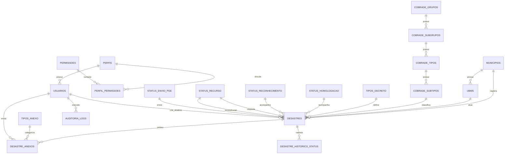

# 05 — DOCUMENTO TÉCNICO
# ESTRUTURA COMPLETA DO BANCO DE DADOS DO SISTEMA DGD

**Sistema:** DGD — Sistema de Gerenciamento de Desastres  
**Órgão gestor:** Coordenadoria Estadual de Defesa Civil do Estado do Pará — CEDEC-PA  
**Público-alvo:** Defesa Civil do Pará  
**Tipo de documento:** Estrutura completa do banco de dados  
**Versão:** 1.0  
**Formato:** Markdown  
**Banco de dados previsto:** MySQL/MariaDB administrado por phpMyAdmin  
**Ambiente de desenvolvimento:** Wampserver com MySQL  
**Ambiente de produção:** Hostinger com PHP, MySQL/MariaDB e phpMyAdmin  
**Status:** Especificação técnica inicial para implantação da base de dados do DGD  

---

## 1. Finalidade do documento

Este documento define a **estrutura completa do banco de dados** do **DGD — Sistema de Gerenciamento de Desastres**, incluindo tabelas, campos, chaves primárias, chaves estrangeiras, índices, tabelas de domínio, tabelas operacionais, tabelas de auditoria, views de apoio e regras de integridade.

O objetivo é entregar uma base relacional consistente para sustentar os módulos definidos nos documentos anteriores:

1. Tela pública de login.
2. Painel.
3. Decretos.
4. Cadastro de desastre.
5. Usuários.
6. Alterar senha.
7. Auditoria operacional.
8. Controle de anexos.
9. Controle de status de homologação, reconhecimento, PGE e recursos.
10. Base COBRADE utilizada no cadastro dos desastres.

A modelagem foi estruturada para funcionamento em **PHP MVC com PDO**, utilizando **MySQL/MariaDB**, com administração por **phpMyAdmin**.

---

## 2. Relação com os documentos anteriores

| Documento | Relação com o banco de dados |
|---|---|
| 01 — Definição Conceitual do Sistema | Define o objetivo do DGD, o escopo funcional e os dados necessários para gestão de decretos e desastres. |
| 02 — Mapa Completo dos Módulos, Páginas e Hierarquia de Navegação | Define as páginas, filtros, listagens, ações e fluxos que precisam ser suportados pelo banco. |
| 03 — Perfis de Usuário e Matriz de Permissões | Define os perfis Admin, Gestor e Operador e orienta as tabelas de perfis, permissões e usuários. |
| 04 — Arquitetura MVC Completa do Sistema | Define a aplicação em PHP MVC, que utilizará esta estrutura por meio de Models, Repositories e Services. |
| 05 — Estrutura Completa do Banco de Dados | Define fisicamente as tabelas, relacionamentos, índices e views. |

O **Documento 06 — Dicionário de Dados Completo do Sistema** deverá detalhar, campo por campo, a finalidade, obrigatoriedade, formato, origem, regra de preenchimento e regra de validação.

---

## 3. Escopo deste documento

Este documento abrange:

1. Padrões de nomenclatura do banco.
2. Organização lógica das tabelas.
3. Modelo relacional geral.
4. Estrutura das tabelas de segurança.
5. Estrutura das tabelas de usuários e permissões.
6. Estrutura das tabelas territoriais.
7. Estrutura das tabelas COBRADE.
8. Estrutura das tabelas de domínio e status.
9. Estrutura da tabela principal de desastres/decretos.
10. Estrutura das tabelas de anexos.
11. Estrutura das tabelas de histórico e auditoria.
12. Views operacionais para listagem e painel.
13. Inserts iniciais mínimos.
14. Ordem recomendada de implantação.
15. Índices e recomendações de performance.
16. Regras de integridade.
17. Estratégia de backup.
18. Critérios de aceite da base de dados.

Não fazem parte deste documento:

1. Código PHP completo.
2. Telas HTML/CSS finais.
3. Manual de uso.
4. Dicionário descritivo completo de cada campo.
5. Scripts completos de carga da COBRADE oficial.
6. Scripts completos de carga dos municípios do Pará.
7. Integração automática com S2ID, PGE ou outros sistemas externos.

---

## 4. Premissas técnicas

A estrutura proposta adota as seguintes premissas:

| Item | Definição |
|---|---|
| SGBD | MySQL 8 ou MariaDB compatível. |
| Engine | InnoDB. |
| Charset | utf8mb4. |
| Collation | utf8mb4_unicode_ci. |
| Linguagem da aplicação | PHP com PDO. |
| Administração | phpMyAdmin. |
| Ambiente local | Wampserver. |
| Ambiente de produção | Hostinger. |
| Padrão de nome | snake_case. |
| Chave primária | id numérico auto incremento. |
| Exclusão | Preferencialmente lógica, usando `excluido_em`. |
| Auditoria | Registro de ações críticas em tabela própria. |
| Anexos | Arquivos armazenados em diretório seguro; banco armazena metadados e caminho. |
| Status | Tabelas de domínio, não texto livre. |
| Campo calculado | Preferencialmente calculado por coluna gerada, view ou service PHP. |

---

## 5. Decisões críticas de modelagem

### 5.1. A tabela principal será `desastres`

Embora o módulo de navegação se chame **Decretos**, o registro operacional completo representa um **desastre cadastrado**, contendo dados de decreto municipal, homologação estadual, reconhecimento, PGE, recursos, afetados e anexos.

Por isso, a tabela principal será:

```text
desastres
```

A listagem do módulo **Decretos** será alimentada por uma view chamada:

```text
vw_decretos_listagem
```

Essa decisão evita uma confusão estrutural. O decreto é parte do registro de desastre, não necessariamente uma entidade isolada na primeira versão do DGD.

---

### 5.2. Status não devem ser salvos como texto livre

Campos como homologação, reconhecimento, recurso de resposta, recurso de reconstrução e envio à PGE não devem ser salvos diretamente como textos digitados pelo usuário.

Modelo incorreto:

```text
homologacao VARCHAR(100)
```

Modelo correto:

```text
homologacao_status_id
```

Com isso, o sistema ganha:

1. Padronização.
2. Filtros confiáveis.
3. Redução de erro de digitação.
4. Facilidade para relatórios.
5. Melhor manutenção dos status oficiais.
6. Compatibilidade com edição rápida na listagem.

---

### 5.3. Status de envio à PGE e status de prazo PGE são conceitos diferentes

O DGD deve separar dois conceitos:

| Campo | Natureza | Origem |
|---|---|---|
| `status_envio_pge_id` | Administrativo/editável | Informado por usuário autorizado. |
| `status_prazo_pge_calculado` | Calculado automaticamente | View, Service PHP ou regra de negócio. |

O status calculado deve seguir a regra operacional informada no escopo:

```text
SE homologação = Homologado → APROVADO
SE duração PGE em dias <= 7 e > 0 → NO PRAZO
SE duração PGE em dias > 7 → PENDENTE
```

Essa separação evita inconsistência. Um usuário pode registrar que o processo foi enviado à PGE, mas o sistema ainda precisa calcular se esse envio ocorreu dentro ou fora do prazo operacional definido.

---

### 5.4. Total de afetados deve ser automático

O total de afetados não deve ser digitado manualmente.

Ele deve ser obtido pela soma de:

1. Óbitos.
2. Feridos.
3. Enfermos.
4. Desabrigados.
5. Desalojados.
6. Outros afetados.

A modelagem proposta utiliza uma coluna gerada:

```sql
total_afetados INT UNSIGNED GENERATED ALWAYS AS (... soma ...) STORED
```

Caso a hospedagem não aceite coluna gerada, a alternativa será calcular o total na aplicação PHP ou em uma view.

---

### 5.5. Anexos não devem ser salvos como BLOB no banco

Não é recomendável salvar os arquivos PDF, DOC, DOCX, JPG ou PNG diretamente no banco como BLOB.

O banco deve guardar apenas:

1. Nome original.
2. Nome interno salvo.
3. Caminho do arquivo.
4. Tipo MIME.
5. Tamanho.
6. Hash de integridade.
7. Tipo de anexo.
8. Usuário responsável pelo upload.
9. Data do upload.

Os arquivos devem ficar em diretório protegido no servidor, fora da pasta pública sempre que possível.

---

### 5.6. Exclusão deve ser lógica

Registros críticos, como desastre, usuário, anexo e histórico, não devem ser apagados fisicamente como regra padrão.

O padrão recomendado é:

```text
ativo = 0
excluido_em = data/hora
excluido_por = usuário responsável
```

A exclusão física deve ser reservada apenas para rotinas administrativas controladas, migração, limpeza técnica ou erro de implantação.

---

## 6. Organização lógica das tabelas

A base de dados será organizada nos seguintes grupos:

| Grupo | Finalidade | Tabelas principais |
|---|---|---|
| Segurança e acesso | Controle de login, perfis e permissões | `usuarios`, `perfis`, `permissoes`, `perfil_permissoes`, `login_logs`, `usuarios_sessoes` |
| Território e órgão atuante | Município e UBM atuante | `municipios`, `ubms` |
| COBRADE | Classificação dos desastres | `cobrade_grupos`, `cobrade_subgrupos`, `cobrade_tipos`, `cobrade_subtipos` |
| Domínios administrativos | Listas padronizadas do sistema | `tipos_decreto`, `status_homologacao`, `status_reconhecimento`, `status_recurso`, `status_envio_pge`, `tipos_anexo` |
| Operação principal | Cadastro de desastre/decreto | `desastres`, `sequencias_protocolos` |
| Documentos | Anexos vinculados ao desastre | `desastre_anexos` |
| Histórico e auditoria | Rastreabilidade | `desastre_historico_status`, `auditoria_logs` |
| Configuração | Parâmetros do sistema | `configuracoes_sistema` |
| Views | Apoio às telas e relatórios | `vw_decretos_listagem`, `vw_painel_resumo` |

---

## 7. Modelo relacional geral



---

## 8. Lista completa das tabelas

| Nº | Tabela | Finalidade |
|---:|---|---|
| 1 | `perfis` | Perfis oficiais do sistema: Admin, Gestor e Operador. |
| 2 | `permissoes` | Catálogo de permissões internas do sistema. |
| 3 | `perfil_permissoes` | Associação entre perfis e permissões. |
| 4 | `usuarios` | Cadastro de usuários autenticados. |
| 5 | `usuarios_sessoes` | Controle opcional de sessões ativas. |
| 6 | `login_logs` | Registro de tentativas de login. |
| 7 | `municipios` | Municípios do Pará. |
| 8 | `ubms` | Unidades/UBMs atuantes. |
| 9 | `cobrade_grupos` | Grupos COBRADE. |
| 10 | `cobrade_subgrupos` | Subgrupos COBRADE. |
| 11 | `cobrade_tipos` | Tipos COBRADE. |
| 12 | `cobrade_subtipos` | Subtipos COBRADE, descrição e simbologia. |
| 13 | `tipos_decreto` | Situação de emergência e estado de calamidade pública. |
| 14 | `status_homologacao` | Status da homologação estadual. |
| 15 | `status_reconhecimento` | Status do reconhecimento. |
| 16 | `status_recurso` | Status de recursos de resposta e reconstrução. |
| 17 | `status_envio_pge` | Status administrativo de envio à PGE. |
| 18 | `tipos_anexo` | Tipos de documentos anexados. |
| 19 | `sequencias_protocolos` | Controle de numeração sequencial anual do protocolo DGD. |
| 20 | `desastres` | Registro principal de desastre/decreto. |
| 21 | `desastre_anexos` | Documentos vinculados ao desastre. |
| 22 | `desastre_historico_status` | Histórico de alterações de status críticos. |
| 23 | `auditoria_logs` | Auditoria geral de ações críticas. |
| 24 | `configuracoes_sistema` | Parâmetros administrativos do sistema. |

---

## 9. Script-base de criação do banco

### 9.1. Criação do banco

```sql
CREATE DATABASE IF NOT EXISTS dgd_db
  CHARACTER SET utf8mb4
  COLLATE utf8mb4_unicode_ci;

USE dgd_db;

SET NAMES utf8mb4;
SET time_zone = '-03:00';
```

Observação técnica: o fuso `-03:00` atende ao horário utilizado no Pará. Na aplicação PHP, também deve ser configurado `date_default_timezone_set('America/Belem')`.

---

## 10. Tabelas de segurança e acesso

### 10.1. Tabela `perfis`

Armazena os perfis oficiais do DGD.

```sql
CREATE TABLE perfis (
    id TINYINT UNSIGNED AUTO_INCREMENT PRIMARY KEY,
    codigo VARCHAR(30) NOT NULL UNIQUE,
    nome VARCHAR(60) NOT NULL,
    descricao TEXT NULL,
    nivel_acesso TINYINT UNSIGNED NOT NULL DEFAULT 1,
    ativo TINYINT(1) NOT NULL DEFAULT 1,
    criado_em DATETIME NOT NULL DEFAULT CURRENT_TIMESTAMP,
    atualizado_em DATETIME NULL DEFAULT NULL ON UPDATE CURRENT_TIMESTAMP
) ENGINE=InnoDB DEFAULT CHARSET=utf8mb4 COLLATE=utf8mb4_unicode_ci;
```

Perfis oficiais previstos:

| Código | Nome | Finalidade |
|---|---|---|
| `ADMIN` | Admin | Administração geral do sistema. |
| `GESTOR` | Gestor | Gestão operacional dos desastres, decretos e status críticos. |
| `OPERADOR` | Operador | Cadastro inicial e consulta operacional controlada. |

---

### 10.2. Tabela `permissoes`

Armazena o catálogo de permissões internas.

```sql
CREATE TABLE permissoes (
    id SMALLINT UNSIGNED AUTO_INCREMENT PRIMARY KEY,
    codigo VARCHAR(80) NOT NULL UNIQUE,
    modulo VARCHAR(60) NOT NULL,
    acao VARCHAR(60) NOT NULL,
    descricao TEXT NULL,
    ativo TINYINT(1) NOT NULL DEFAULT 1,
    criado_em DATETIME NOT NULL DEFAULT CURRENT_TIMESTAMP,
    atualizado_em DATETIME NULL DEFAULT NULL ON UPDATE CURRENT_TIMESTAMP,
    INDEX idx_permissoes_modulo (modulo),
    INDEX idx_permissoes_acao (acao)
) ENGINE=InnoDB DEFAULT CHARSET=utf8mb4 COLLATE=utf8mb4_unicode_ci;
```

---

### 10.3. Tabela `perfil_permissoes`

Relaciona perfis com permissões.

```sql
CREATE TABLE perfil_permissoes (
    perfil_id TINYINT UNSIGNED NOT NULL,
    permissao_id SMALLINT UNSIGNED NOT NULL,
    criado_em DATETIME NOT NULL DEFAULT CURRENT_TIMESTAMP,
    PRIMARY KEY (perfil_id, permissao_id),
    CONSTRAINT fk_perfil_permissoes_perfil
        FOREIGN KEY (perfil_id) REFERENCES perfis(id)
        ON UPDATE CASCADE ON DELETE RESTRICT,
    CONSTRAINT fk_perfil_permissoes_permissao
        FOREIGN KEY (permissao_id) REFERENCES permissoes(id)
        ON UPDATE CASCADE ON DELETE RESTRICT
) ENGINE=InnoDB DEFAULT CHARSET=utf8mb4 COLLATE=utf8mb4_unicode_ci;
```

---

### 10.4. Tabela `usuarios`

Armazena os usuários autenticados do DGD.

```sql
CREATE TABLE usuarios (
    id BIGINT UNSIGNED AUTO_INCREMENT PRIMARY KEY,
    perfil_id TINYINT UNSIGNED NOT NULL,
    nome VARCHAR(150) NOT NULL,
    email VARCHAR(180) NOT NULL UNIQUE,
    cpf VARCHAR(14) NULL UNIQUE,
    telefone VARCHAR(30) NULL,
    cargo VARCHAR(120) NULL,
    instituicao VARCHAR(150) NOT NULL DEFAULT 'CEDEC-PA',
    senha_hash VARCHAR(255) NOT NULL,
    ativo TINYINT(1) NOT NULL DEFAULT 1,
    trocar_senha_proximo_acesso TINYINT(1) NOT NULL DEFAULT 0,
    ultimo_acesso_em DATETIME NULL,
    tentativas_login_falhas TINYINT UNSIGNED NOT NULL DEFAULT 0,
    bloqueado_ate DATETIME NULL,
    criado_por BIGINT UNSIGNED NULL,
    atualizado_por BIGINT UNSIGNED NULL,
    excluido_por BIGINT UNSIGNED NULL,
    criado_em DATETIME NOT NULL DEFAULT CURRENT_TIMESTAMP,
    atualizado_em DATETIME NULL DEFAULT NULL ON UPDATE CURRENT_TIMESTAMP,
    excluido_em DATETIME NULL,
    CONSTRAINT fk_usuarios_perfil
        FOREIGN KEY (perfil_id) REFERENCES perfis(id)
        ON UPDATE CASCADE ON DELETE RESTRICT,
    CONSTRAINT fk_usuarios_criado_por
        FOREIGN KEY (criado_por) REFERENCES usuarios(id)
        ON UPDATE CASCADE ON DELETE SET NULL,
    CONSTRAINT fk_usuarios_atualizado_por
        FOREIGN KEY (atualizado_por) REFERENCES usuarios(id)
        ON UPDATE CASCADE ON DELETE SET NULL,
    CONSTRAINT fk_usuarios_excluido_por
        FOREIGN KEY (excluido_por) REFERENCES usuarios(id)
        ON UPDATE CASCADE ON DELETE SET NULL,
    INDEX idx_usuarios_perfil (perfil_id),
    INDEX idx_usuarios_ativo (ativo),
    INDEX idx_usuarios_nome (nome),
    INDEX idx_usuarios_email (email)
) ENGINE=InnoDB DEFAULT CHARSET=utf8mb4 COLLATE=utf8mb4_unicode_ci;
```

Regras mínimas associadas:

1. `senha_hash` deve armazenar somente hash seguro, gerado por `password_hash()` no PHP.
2. O sistema não deve armazenar senha em texto puro.
3. A exclusão de usuário deve ser lógica.
4. Usuários vinculados como analistas, criadores ou editores não devem ser apagados fisicamente.
5. CPF pode ser opcional, mas se informado deve ser único.

---

### 10.5. Tabela `usuarios_sessoes`

Tabela opcional para controle de sessões autenticadas.

```sql
CREATE TABLE usuarios_sessoes (
    id BIGINT UNSIGNED AUTO_INCREMENT PRIMARY KEY,
    usuario_id BIGINT UNSIGNED NOT NULL,
    session_id_hash CHAR(64) NOT NULL,
    ip VARCHAR(45) NULL,
    user_agent VARCHAR(255) NULL,
    iniciou_em DATETIME NOT NULL DEFAULT CURRENT_TIMESTAMP,
    expira_em DATETIME NULL,
    encerrada_em DATETIME NULL,
    ativa TINYINT(1) NOT NULL DEFAULT 1,
    CONSTRAINT fk_usuarios_sessoes_usuario
        FOREIGN KEY (usuario_id) REFERENCES usuarios(id)
        ON UPDATE CASCADE ON DELETE RESTRICT,
    UNIQUE KEY uq_usuarios_sessoes_hash (session_id_hash),
    INDEX idx_usuarios_sessoes_usuario (usuario_id),
    INDEX idx_usuarios_sessoes_ativa (ativa)
) ENGINE=InnoDB DEFAULT CHARSET=utf8mb4 COLLATE=utf8mb4_unicode_ci;
```

---

### 10.6. Tabela `login_logs`

Registra tentativas de autenticação.

```sql
CREATE TABLE login_logs (
    id BIGINT UNSIGNED AUTO_INCREMENT PRIMARY KEY,
    usuario_id BIGINT UNSIGNED NULL,
    email_informado VARCHAR(180) NULL,
    sucesso TINYINT(1) NOT NULL DEFAULT 0,
    motivo_falha VARCHAR(120) NULL,
    ip VARCHAR(45) NULL,
    user_agent VARCHAR(255) NULL,
    criado_em DATETIME NOT NULL DEFAULT CURRENT_TIMESTAMP,
    CONSTRAINT fk_login_logs_usuario
        FOREIGN KEY (usuario_id) REFERENCES usuarios(id)
        ON UPDATE CASCADE ON DELETE SET NULL,
    INDEX idx_login_logs_usuario (usuario_id),
    INDEX idx_login_logs_email (email_informado),
    INDEX idx_login_logs_sucesso (sucesso),
    INDEX idx_login_logs_criado_em (criado_em)
) ENGINE=InnoDB DEFAULT CHARSET=utf8mb4 COLLATE=utf8mb4_unicode_ci;
```

---

## 11. Tabelas territoriais e institucionais

### 11.1. Tabela `municipios`

Armazena os municípios do Pará.

```sql
CREATE TABLE municipios (
    id INT UNSIGNED AUTO_INCREMENT PRIMARY KEY,
    codigo_ibge INT UNSIGNED NULL UNIQUE,
    nome VARCHAR(150) NOT NULL,
    uf CHAR(2) NOT NULL DEFAULT 'PA',
    ativo TINYINT(1) NOT NULL DEFAULT 1,
    criado_em DATETIME NOT NULL DEFAULT CURRENT_TIMESTAMP,
    atualizado_em DATETIME NULL DEFAULT NULL ON UPDATE CURRENT_TIMESTAMP,
    UNIQUE KEY uq_municipios_nome_uf (nome, uf),
    INDEX idx_municipios_nome (nome),
    INDEX idx_municipios_uf (uf),
    INDEX idx_municipios_ativo (ativo)
) ENGINE=InnoDB DEFAULT CHARSET=utf8mb4 COLLATE=utf8mb4_unicode_ci;
```

Observação: recomenda-se carregar os municípios do Pará a partir de fonte oficial ou planilha validada pela CEDEC-PA, incluindo o código IBGE.

---

### 11.2. Tabela `ubms`

Armazena as UBM/unidades atuantes informadas no cadastro do desastre.

```sql
CREATE TABLE ubms (
    id INT UNSIGNED AUTO_INCREMENT PRIMARY KEY,
    municipio_id INT UNSIGNED NULL,
    nome VARCHAR(150) NOT NULL,
    sigla VARCHAR(40) NULL,
    descricao TEXT NULL,
    ativo TINYINT(1) NOT NULL DEFAULT 1,
    criado_em DATETIME NOT NULL DEFAULT CURRENT_TIMESTAMP,
    atualizado_em DATETIME NULL DEFAULT NULL ON UPDATE CURRENT_TIMESTAMP,
    CONSTRAINT fk_ubms_municipio
        FOREIGN KEY (municipio_id) REFERENCES municipios(id)
        ON UPDATE CASCADE ON DELETE SET NULL,
    INDEX idx_ubms_municipio (municipio_id),
    INDEX idx_ubms_nome (nome),
    INDEX idx_ubms_ativo (ativo)
) ENGINE=InnoDB DEFAULT CHARSET=utf8mb4 COLLATE=utf8mb4_unicode_ci;
```

---

## 12. Tabelas COBRADE

A classificação COBRADE será estruturada em quatro níveis:

1. Grupo.
2. Subgrupo.
3. Tipo.
4. Subtipo.

O cadastro de desastre deve apontar para o menor nível aplicável, preferencialmente `cobrade_subtipo_id`. A partir dele, o sistema recupera grupo, subgrupo, tipo, descrição e simbologia.

---

### 12.1. Tabela `cobrade_grupos`

```sql
CREATE TABLE cobrade_grupos (
    id INT UNSIGNED AUTO_INCREMENT PRIMARY KEY,
    codigo VARCHAR(20) NOT NULL UNIQUE,
    nome VARCHAR(150) NOT NULL,
    descricao TEXT NULL,
    ativo TINYINT(1) NOT NULL DEFAULT 1,
    criado_em DATETIME NOT NULL DEFAULT CURRENT_TIMESTAMP,
    atualizado_em DATETIME NULL DEFAULT NULL ON UPDATE CURRENT_TIMESTAMP,
    INDEX idx_cobrade_grupos_nome (nome),
    INDEX idx_cobrade_grupos_ativo (ativo)
) ENGINE=InnoDB DEFAULT CHARSET=utf8mb4 COLLATE=utf8mb4_unicode_ci;
```

---

### 12.2. Tabela `cobrade_subgrupos`

```sql
CREATE TABLE cobrade_subgrupos (
    id INT UNSIGNED AUTO_INCREMENT PRIMARY KEY,
    grupo_id INT UNSIGNED NOT NULL,
    codigo VARCHAR(20) NOT NULL,
    nome VARCHAR(150) NOT NULL,
    descricao TEXT NULL,
    ativo TINYINT(1) NOT NULL DEFAULT 1,
    criado_em DATETIME NOT NULL DEFAULT CURRENT_TIMESTAMP,
    atualizado_em DATETIME NULL DEFAULT NULL ON UPDATE CURRENT_TIMESTAMP,
    CONSTRAINT fk_cobrade_subgrupos_grupo
        FOREIGN KEY (grupo_id) REFERENCES cobrade_grupos(id)
        ON UPDATE CASCADE ON DELETE RESTRICT,
    UNIQUE KEY uq_cobrade_subgrupos_grupo_codigo (grupo_id, codigo),
    INDEX idx_cobrade_subgrupos_grupo (grupo_id),
    INDEX idx_cobrade_subgrupos_nome (nome),
    INDEX idx_cobrade_subgrupos_ativo (ativo)
) ENGINE=InnoDB DEFAULT CHARSET=utf8mb4 COLLATE=utf8mb4_unicode_ci;
```

---

### 12.3. Tabela `cobrade_tipos`

```sql
CREATE TABLE cobrade_tipos (
    id INT UNSIGNED AUTO_INCREMENT PRIMARY KEY,
    subgrupo_id INT UNSIGNED NOT NULL,
    codigo VARCHAR(20) NOT NULL,
    nome VARCHAR(150) NOT NULL,
    descricao TEXT NULL,
    ativo TINYINT(1) NOT NULL DEFAULT 1,
    criado_em DATETIME NOT NULL DEFAULT CURRENT_TIMESTAMP,
    atualizado_em DATETIME NULL DEFAULT NULL ON UPDATE CURRENT_TIMESTAMP,
    CONSTRAINT fk_cobrade_tipos_subgrupo
        FOREIGN KEY (subgrupo_id) REFERENCES cobrade_subgrupos(id)
        ON UPDATE CASCADE ON DELETE RESTRICT,
    UNIQUE KEY uq_cobrade_tipos_subgrupo_codigo (subgrupo_id, codigo),
    INDEX idx_cobrade_tipos_subgrupo (subgrupo_id),
    INDEX idx_cobrade_tipos_nome (nome),
    INDEX idx_cobrade_tipos_ativo (ativo)
) ENGINE=InnoDB DEFAULT CHARSET=utf8mb4 COLLATE=utf8mb4_unicode_ci;
```

---

### 12.4. Tabela `cobrade_subtipos`

```sql
CREATE TABLE cobrade_subtipos (
    id INT UNSIGNED AUTO_INCREMENT PRIMARY KEY,
    tipo_id INT UNSIGNED NOT NULL,
    codigo VARCHAR(30) NOT NULL,
    nome VARCHAR(180) NOT NULL,
    descricao TEXT NULL,
    simbologia VARCHAR(255) NULL,
    origem VARCHAR(120) NULL DEFAULT 'PLANCON/COBRADE',
    versao VARCHAR(40) NULL,
    ativo TINYINT(1) NOT NULL DEFAULT 1,
    criado_em DATETIME NOT NULL DEFAULT CURRENT_TIMESTAMP,
    atualizado_em DATETIME NULL DEFAULT NULL ON UPDATE CURRENT_TIMESTAMP,
    CONSTRAINT fk_cobrade_subtipos_tipo
        FOREIGN KEY (tipo_id) REFERENCES cobrade_tipos(id)
        ON UPDATE CASCADE ON DELETE RESTRICT,
    UNIQUE KEY uq_cobrade_subtipos_codigo (codigo),
    INDEX idx_cobrade_subtipos_tipo (tipo_id),
    INDEX idx_cobrade_subtipos_nome (nome),
    INDEX idx_cobrade_subtipos_ativo (ativo)
) ENGINE=InnoDB DEFAULT CHARSET=utf8mb4 COLLATE=utf8mb4_unicode_ci;
```

Recomendação: importar a base COBRADE já utilizada no sistema PLANCON, preservando código, descrição e simbologia. O DGD não deve depender de digitação manual dessa classificação.

---

## 13. Tabelas de domínio e status

### 13.1. Tabela `tipos_decreto`

```sql
CREATE TABLE tipos_decreto (
    id TINYINT UNSIGNED AUTO_INCREMENT PRIMARY KEY,
    codigo VARCHAR(40) NOT NULL UNIQUE,
    nome VARCHAR(120) NOT NULL,
    descricao TEXT NULL,
    prazo_padrao_dias SMALLINT UNSIGNED NULL,
    ativo TINYINT(1) NOT NULL DEFAULT 1,
    ordem TINYINT UNSIGNED NOT NULL DEFAULT 1,
    criado_em DATETIME NOT NULL DEFAULT CURRENT_TIMESTAMP,
    atualizado_em DATETIME NULL DEFAULT NULL ON UPDATE CURRENT_TIMESTAMP,
    INDEX idx_tipos_decreto_ativo (ativo),
    INDEX idx_tipos_decreto_ordem (ordem)
) ENGINE=InnoDB DEFAULT CHARSET=utf8mb4 COLLATE=utf8mb4_unicode_ci;
```

Tipos previstos:

1. Situação de Emergência.
2. Estado de Calamidade Pública.

---

### 13.2. Tabela `status_homologacao`

```sql
CREATE TABLE status_homologacao (
    id TINYINT UNSIGNED AUTO_INCREMENT PRIMARY KEY,
    codigo VARCHAR(50) NOT NULL UNIQUE,
    nome VARCHAR(120) NOT NULL,
    descricao TEXT NULL,
    classe_css VARCHAR(60) NULL,
    ativo TINYINT(1) NOT NULL DEFAULT 1,
    ordem TINYINT UNSIGNED NOT NULL DEFAULT 1,
    criado_em DATETIME NOT NULL DEFAULT CURRENT_TIMESTAMP,
    atualizado_em DATETIME NULL DEFAULT NULL ON UPDATE CURRENT_TIMESTAMP,
    INDEX idx_status_homologacao_ativo (ativo),
    INDEX idx_status_homologacao_ordem (ordem)
) ENGINE=InnoDB DEFAULT CHARSET=utf8mb4 COLLATE=utf8mb4_unicode_ci;
```

Status previstos:

1. Não registrado.
2. Não solicitado.
3. Solicitado.
4. Pendente - despacho.
5. Pendente - parecer.
6. Em análise DGD.
7. Enviado PGE.
8. Homologado.
9. Não homologado.

---

### 13.3. Tabela `status_reconhecimento`

```sql
CREATE TABLE status_reconhecimento (
    id TINYINT UNSIGNED AUTO_INCREMENT PRIMARY KEY,
    codigo VARCHAR(60) NOT NULL UNIQUE,
    nome VARCHAR(140) NOT NULL,
    descricao TEXT NULL,
    classe_css VARCHAR(60) NULL,
    ativo TINYINT(1) NOT NULL DEFAULT 1,
    ordem TINYINT UNSIGNED NOT NULL DEFAULT 1,
    criado_em DATETIME NOT NULL DEFAULT CURRENT_TIMESTAMP,
    atualizado_em DATETIME NULL DEFAULT NULL ON UPDATE CURRENT_TIMESTAMP,
    INDEX idx_status_reconhecimento_ativo (ativo),
    INDEX idx_status_reconhecimento_ordem (ordem)
) ENGINE=InnoDB DEFAULT CHARSET=utf8mb4 COLLATE=utf8mb4_unicode_ci;
```

Status previstos:

1. Não registrado.
2. Solicitado.
3. Aguardando análise.
4. Em análise SEDEC.
5. Enviado para reconhecimento.
6. Aguardando ajuste município.
7. Registrado.
8. Reconhecido.
9. Não reconhecido.

---

### 13.4. Tabela `status_recurso`

A mesma tabela será usada para:

1. Recursos de ação de resposta.
2. Recursos de ação de reconstrução.

```sql
CREATE TABLE status_recurso (
    id TINYINT UNSIGNED AUTO_INCREMENT PRIMARY KEY,
    codigo VARCHAR(60) NOT NULL UNIQUE,
    nome VARCHAR(140) NOT NULL,
    descricao TEXT NULL,
    classe_css VARCHAR(60) NULL,
    ativo TINYINT(1) NOT NULL DEFAULT 1,
    ordem TINYINT UNSIGNED NOT NULL DEFAULT 1,
    criado_em DATETIME NOT NULL DEFAULT CURRENT_TIMESTAMP,
    atualizado_em DATETIME NULL DEFAULT NULL ON UPDATE CURRENT_TIMESTAMP,
    INDEX idx_status_recurso_ativo (ativo),
    INDEX idx_status_recurso_ordem (ordem)
) ENGINE=InnoDB DEFAULT CHARSET=utf8mb4 COLLATE=utf8mb4_unicode_ci;
```

Status previstos:

1. Não registrado.
2. Não solicitado.
3. Solicitado.
4. Aguardando ajustes.
5. Em análise SEDEC.
6. Plano aprovado.
7. Recurso deferido.
8. Recurso indeferido.
9. Registro de revisão.
10. Empenho.

---

### 13.5. Tabela `status_envio_pge`

```sql
CREATE TABLE status_envio_pge (
    id TINYINT UNSIGNED AUTO_INCREMENT PRIMARY KEY,
    codigo VARCHAR(60) NOT NULL UNIQUE,
    nome VARCHAR(140) NOT NULL,
    descricao TEXT NULL,
    classe_css VARCHAR(60) NULL,
    ativo TINYINT(1) NOT NULL DEFAULT 1,
    ordem TINYINT UNSIGNED NOT NULL DEFAULT 1,
    criado_em DATETIME NOT NULL DEFAULT CURRENT_TIMESTAMP,
    atualizado_em DATETIME NULL DEFAULT NULL ON UPDATE CURRENT_TIMESTAMP,
    INDEX idx_status_envio_pge_ativo (ativo),
    INDEX idx_status_envio_pge_ordem (ordem)
) ENGINE=InnoDB DEFAULT CHARSET=utf8mb4 COLLATE=utf8mb4_unicode_ci;
```

Status administrativos sugeridos:

1. Não registrado.
2. Não enviado.
3. Em preparação.
4. Enviado à PGE.
5. Retornado para ajuste.
6. Concluído.

Esses status podem ser ajustados pela CEDEC-PA sem alterar a estrutura da tabela.

---

### 13.6. Tabela `tipos_anexo`

```sql
CREATE TABLE tipos_anexo (
    id TINYINT UNSIGNED AUTO_INCREMENT PRIMARY KEY,
    codigo VARCHAR(60) NOT NULL UNIQUE,
    nome VARCHAR(140) NOT NULL,
    descricao TEXT NULL,
    obrigatorio TINYINT(1) NOT NULL DEFAULT 0,
    ativo TINYINT(1) NOT NULL DEFAULT 1,
    ordem TINYINT UNSIGNED NOT NULL DEFAULT 1,
    criado_em DATETIME NOT NULL DEFAULT CURRENT_TIMESTAMP,
    atualizado_em DATETIME NULL DEFAULT NULL ON UPDATE CURRENT_TIMESTAMP,
    INDEX idx_tipos_anexo_ativo (ativo),
    INDEX idx_tipos_anexo_ordem (ordem)
) ENGINE=InnoDB DEFAULT CHARSET=utf8mb4 COLLATE=utf8mb4_unicode_ci;
```

Tipos previstos:

1. Decreto municipal.
2. Ofício de homologação.
3. Parecer estadual.
4. Parecer municipal.
5. Outros documentos.

---

## 14. Tabela de sequência de protocolo DGD

### 14.1. Tabela `sequencias_protocolos`

Controla o sequencial anual do protocolo DGD.

```sql
CREATE TABLE sequencias_protocolos (
    ano SMALLINT UNSIGNED PRIMARY KEY,
    ultimo_sequencial INT UNSIGNED NOT NULL DEFAULT 0,
    atualizado_em DATETIME NOT NULL DEFAULT CURRENT_TIMESTAMP ON UPDATE CURRENT_TIMESTAMP
) ENGINE=InnoDB DEFAULT CHARSET=utf8mb4 COLLATE=utf8mb4_unicode_ci;
```

Regra de geração do protocolo:

```text
DGD-{ANO}-{SEQUENCIAL}-{DATA_DESASTRE}-{MUNICIPIO_NORMALIZADO}
```

Exemplo:

```text
DGD-2026-000001-20260115-BELEM
```

Onde:

| Componente | Origem |
|---|---|
| `DGD` | Prefixo fixo. |
| `ANO` | Ano da data do desastre. |
| `SEQUENCIAL` | Número sequencial anual controlado por `sequencias_protocolos`. |
| `DATA_DESASTRE` | Data do desastre no formato `AAAAMMDD`. |
| `MUNICIPIO_NORMALIZADO` | Município sem acentos, em caixa alta e com espaços tratados. |

Recomendação crítica: o protocolo deve ser gerado em transação para evitar duplicidade quando dois usuários cadastrarem desastres simultaneamente.

Fluxo recomendado no PHP:

```text
1. Iniciar transação.
2. Localizar linha do ano em sequencias_protocolos com bloqueio.
3. Se não existir, criar linha para o ano.
4. Incrementar ultimo_sequencial.
5. Montar protocolo DGD.
6. Inserir desastre.
7. Confirmar transação.
```

---

## 15. Tabela principal `desastres`

A tabela `desastres` é o núcleo do DGD.

Ela concentra:

1. Protocolo DGD.
2. Município.
3. UBM atuante.
4. Tipo de decreto.
5. Classificação COBRADE.
6. Data do desastre.
7. Protocolo S2ID.
8. Decreto municipal.
9. Decreto estadual de homologação.
10. Homologação.
11. Reconhecimento.
12. PGE.
13. Analista.
14. Recursos de resposta.
15. Recursos de reconstrução.
16. Danos humanos.
17. Total automático de afetados.
18. Controle de criação, edição e exclusão.

```sql
CREATE TABLE desastres (
    id BIGINT UNSIGNED AUTO_INCREMENT PRIMARY KEY,

    protocolo_dgd VARCHAR(120) NOT NULL,
    protocolo_ano SMALLINT UNSIGNED NOT NULL,
    protocolo_sequencial INT UNSIGNED NOT NULL,

    municipio_id INT UNSIGNED NOT NULL,
    ubm_id INT UNSIGNED NULL,
    tipo_decreto_id TINYINT UNSIGNED NOT NULL,
    cobrade_subtipo_id INT UNSIGNED NOT NULL,

    data_desastre DATE NOT NULL,
    protocolo_s2id VARCHAR(80) NULL,

    numero_decreto_municipal VARCHAR(80) NULL,
    data_decreto_municipal DATE NULL,

    numero_decreto_homologacao_estadual VARCHAR(80) NULL,
    data_decreto_homologacao DATE NULL,

    homologacao_status_id TINYINT UNSIGNED NOT NULL DEFAULT 1,
    reconhecimento_status_id TINYINT UNSIGNED NOT NULL DEFAULT 1,

    protocolo_pae_pge VARCHAR(100) NULL,
    data_envio_pge DATE NULL,
    status_envio_pge_id TINYINT UNSIGNED NOT NULL DEFAULT 1,

    analista_id BIGINT UNSIGNED NULL,

    recurso_resposta_status_id TINYINT UNSIGNED NOT NULL DEFAULT 1,
    recurso_reconstrucao_status_id TINYINT UNSIGNED NOT NULL DEFAULT 1,

    numero_obitos INT UNSIGNED NOT NULL DEFAULT 0,
    numero_feridos INT UNSIGNED NOT NULL DEFAULT 0,
    numero_enfermos INT UNSIGNED NOT NULL DEFAULT 0,
    numero_desabrigados INT UNSIGNED NOT NULL DEFAULT 0,
    numero_desalojados INT UNSIGNED NOT NULL DEFAULT 0,
    numero_outros_afetados INT UNSIGNED NOT NULL DEFAULT 0,

    total_afetados INT UNSIGNED GENERATED ALWAYS AS (
        numero_obitos +
        numero_feridos +
        numero_enfermos +
        numero_desabrigados +
        numero_desalojados +
        numero_outros_afetados
    ) STORED,

    observacoes TEXT NULL,

    ativo TINYINT(1) NOT NULL DEFAULT 1,
    criado_por BIGINT UNSIGNED NULL,
    atualizado_por BIGINT UNSIGNED NULL,
    excluido_por BIGINT UNSIGNED NULL,
    criado_em DATETIME NOT NULL DEFAULT CURRENT_TIMESTAMP,
    atualizado_em DATETIME NULL DEFAULT NULL ON UPDATE CURRENT_TIMESTAMP,
    excluido_em DATETIME NULL,

    UNIQUE KEY uq_desastres_protocolo_dgd (protocolo_dgd),
    UNIQUE KEY uq_desastres_ano_sequencial (protocolo_ano, protocolo_sequencial),

    CONSTRAINT fk_desastres_municipio
        FOREIGN KEY (municipio_id) REFERENCES municipios(id)
        ON UPDATE CASCADE ON DELETE RESTRICT,
    CONSTRAINT fk_desastres_ubm
        FOREIGN KEY (ubm_id) REFERENCES ubms(id)
        ON UPDATE CASCADE ON DELETE SET NULL,
    CONSTRAINT fk_desastres_tipo_decreto
        FOREIGN KEY (tipo_decreto_id) REFERENCES tipos_decreto(id)
        ON UPDATE CASCADE ON DELETE RESTRICT,
    CONSTRAINT fk_desastres_cobrade_subtipo
        FOREIGN KEY (cobrade_subtipo_id) REFERENCES cobrade_subtipos(id)
        ON UPDATE CASCADE ON DELETE RESTRICT,
    CONSTRAINT fk_desastres_homologacao_status
        FOREIGN KEY (homologacao_status_id) REFERENCES status_homologacao(id)
        ON UPDATE CASCADE ON DELETE RESTRICT,
    CONSTRAINT fk_desastres_reconhecimento_status
        FOREIGN KEY (reconhecimento_status_id) REFERENCES status_reconhecimento(id)
        ON UPDATE CASCADE ON DELETE RESTRICT,
    CONSTRAINT fk_desastres_status_envio_pge
        FOREIGN KEY (status_envio_pge_id) REFERENCES status_envio_pge(id)
        ON UPDATE CASCADE ON DELETE RESTRICT,
    CONSTRAINT fk_desastres_analista
        FOREIGN KEY (analista_id) REFERENCES usuarios(id)
        ON UPDATE CASCADE ON DELETE SET NULL,
    CONSTRAINT fk_desastres_recurso_resposta_status
        FOREIGN KEY (recurso_resposta_status_id) REFERENCES status_recurso(id)
        ON UPDATE CASCADE ON DELETE RESTRICT,
    CONSTRAINT fk_desastres_recurso_reconstrucao_status
        FOREIGN KEY (recurso_reconstrucao_status_id) REFERENCES status_recurso(id)
        ON UPDATE CASCADE ON DELETE RESTRICT,
    CONSTRAINT fk_desastres_criado_por
        FOREIGN KEY (criado_por) REFERENCES usuarios(id)
        ON UPDATE CASCADE ON DELETE SET NULL,
    CONSTRAINT fk_desastres_atualizado_por
        FOREIGN KEY (atualizado_por) REFERENCES usuarios(id)
        ON UPDATE CASCADE ON DELETE SET NULL,
    CONSTRAINT fk_desastres_excluido_por
        FOREIGN KEY (excluido_por) REFERENCES usuarios(id)
        ON UPDATE CASCADE ON DELETE SET NULL,

    INDEX idx_desastres_municipio (municipio_id),
    INDEX idx_desastres_ubm (ubm_id),
    INDEX idx_desastres_tipo_decreto (tipo_decreto_id),
    INDEX idx_desastres_cobrade_subtipo (cobrade_subtipo_id),
    INDEX idx_desastres_data_desastre (data_desastre),
    INDEX idx_desastres_data_decreto_municipal (data_decreto_municipal),
    INDEX idx_desastres_homologacao (homologacao_status_id),
    INDEX idx_desastres_reconhecimento (reconhecimento_status_id),
    INDEX idx_desastres_status_envio_pge (status_envio_pge_id),
    INDEX idx_desastres_analista (analista_id),
    INDEX idx_desastres_protocolo_s2id (protocolo_s2id),
    INDEX idx_desastres_protocolo_pae_pge (protocolo_pae_pge),
    INDEX idx_desastres_ativo (ativo),
    INDEX idx_desastres_excluido_em (excluido_em)
) ENGINE=InnoDB DEFAULT CHARSET=utf8mb4 COLLATE=utf8mb4_unicode_ci;
```

### 15.1. Observação sobre coluna gerada

Se o ambiente de produção não aceitar coluna gerada, substituir o trecho:

```sql
total_afetados INT UNSIGNED GENERATED ALWAYS AS (...) STORED
```

por:

```sql
total_afetados INT UNSIGNED NOT NULL DEFAULT 0
```

Nesse caso, a soma deve ser atualizada obrigatoriamente pelo `DesastreService` no backend antes de inserir ou alterar o registro.

A opção com coluna gerada é superior porque reduz risco de divergência entre os campos individuais e o total.

---

## 16. Tabela de anexos

### 16.1. Tabela `desastre_anexos`

```sql
CREATE TABLE desastre_anexos (
    id BIGINT UNSIGNED AUTO_INCREMENT PRIMARY KEY,
    desastre_id BIGINT UNSIGNED NOT NULL,
    tipo_anexo_id TINYINT UNSIGNED NOT NULL,
    nome_original VARCHAR(255) NOT NULL,
    nome_arquivo VARCHAR(255) NOT NULL,
    caminho_arquivo VARCHAR(500) NOT NULL,
    mime_type VARCHAR(120) NOT NULL,
    extensao VARCHAR(20) NOT NULL,
    tamanho_bytes BIGINT UNSIGNED NOT NULL,
    hash_sha256 CHAR(64) NULL,
    descricao TEXT NULL,
    enviado_por BIGINT UNSIGNED NULL,
    enviado_em DATETIME NOT NULL DEFAULT CURRENT_TIMESTAMP,
    ativo TINYINT(1) NOT NULL DEFAULT 1,
    excluido_por BIGINT UNSIGNED NULL,
    excluido_em DATETIME NULL,

    CONSTRAINT fk_desastre_anexos_desastre
        FOREIGN KEY (desastre_id) REFERENCES desastres(id)
        ON UPDATE CASCADE ON DELETE RESTRICT,
    CONSTRAINT fk_desastre_anexos_tipo
        FOREIGN KEY (tipo_anexo_id) REFERENCES tipos_anexo(id)
        ON UPDATE CASCADE ON DELETE RESTRICT,
    CONSTRAINT fk_desastre_anexos_enviado_por
        FOREIGN KEY (enviado_por) REFERENCES usuarios(id)
        ON UPDATE CASCADE ON DELETE SET NULL,
    CONSTRAINT fk_desastre_anexos_excluido_por
        FOREIGN KEY (excluido_por) REFERENCES usuarios(id)
        ON UPDATE CASCADE ON DELETE SET NULL,

    INDEX idx_desastre_anexos_desastre (desastre_id),
    INDEX idx_desastre_anexos_tipo (tipo_anexo_id),
    INDEX idx_desastre_anexos_enviado_por (enviado_por),
    INDEX idx_desastre_anexos_ativo (ativo),
    INDEX idx_desastre_anexos_enviado_em (enviado_em)
) ENGINE=InnoDB DEFAULT CHARSET=utf8mb4 COLLATE=utf8mb4_unicode_ci;
```

Regras mínimas:

1. O arquivo deve ser validado por extensão e MIME type.
2. O nome físico deve ser renomeado pelo sistema.
3. O caminho não deve permitir execução de script.
4. O download deve passar por controller autenticado.
5. A exclusão deve ser lógica.
6. O hash SHA-256 é recomendado para controle de integridade.

Extensões recomendadas para a primeira versão:

```text
pdf, doc, docx, jpg, jpeg, png
```

---

## 17. Histórico e auditoria

### 17.1. Tabela `desastre_historico_status`

Registra mudanças em campos críticos de status do desastre.

```sql
CREATE TABLE desastre_historico_status (
    id BIGINT UNSIGNED AUTO_INCREMENT PRIMARY KEY,
    desastre_id BIGINT UNSIGNED NOT NULL,
    campo_alterado VARCHAR(80) NOT NULL,
    status_anterior_codigo VARCHAR(80) NULL,
    status_anterior_nome VARCHAR(140) NULL,
    status_novo_codigo VARCHAR(80) NULL,
    status_novo_nome VARCHAR(140) NULL,
    observacao TEXT NULL,
    alterado_por BIGINT UNSIGNED NULL,
    alterado_em DATETIME NOT NULL DEFAULT CURRENT_TIMESTAMP,

    CONSTRAINT fk_desastre_historico_status_desastre
        FOREIGN KEY (desastre_id) REFERENCES desastres(id)
        ON UPDATE CASCADE ON DELETE RESTRICT,
    CONSTRAINT fk_desastre_historico_status_usuario
        FOREIGN KEY (alterado_por) REFERENCES usuarios(id)
        ON UPDATE CASCADE ON DELETE SET NULL,

    INDEX idx_desastre_historico_status_desastre (desastre_id),
    INDEX idx_desastre_historico_status_campo (campo_alterado),
    INDEX idx_desastre_historico_status_usuario (alterado_por),
    INDEX idx_desastre_historico_status_data (alterado_em)
) ENGINE=InnoDB DEFAULT CHARSET=utf8mb4 COLLATE=utf8mb4_unicode_ci;
```

Campos críticos que devem gerar histórico:

1. `homologacao_status_id`.
2. `reconhecimento_status_id`.
3. `status_envio_pge_id`.
4. `recurso_resposta_status_id`.
5. `recurso_reconstrucao_status_id`.
6. `analista_id`.
7. `data_envio_pge`.
8. `numero_decreto_homologacao_estadual`.
9. `data_decreto_homologacao`.

---

### 17.2. Tabela `auditoria_logs`

Registra eventos críticos gerais do sistema.

```sql
CREATE TABLE auditoria_logs (
    id BIGINT UNSIGNED AUTO_INCREMENT PRIMARY KEY,
    usuario_id BIGINT UNSIGNED NULL,
    entidade VARCHAR(80) NOT NULL,
    entidade_id BIGINT UNSIGNED NULL,
    acao VARCHAR(80) NOT NULL,
    descricao TEXT NULL,
    dados_antes JSON NULL,
    dados_depois JSON NULL,
    ip VARCHAR(45) NULL,
    user_agent VARCHAR(255) NULL,
    criado_em DATETIME NOT NULL DEFAULT CURRENT_TIMESTAMP,

    CONSTRAINT fk_auditoria_logs_usuario
        FOREIGN KEY (usuario_id) REFERENCES usuarios(id)
        ON UPDATE CASCADE ON DELETE SET NULL,

    INDEX idx_auditoria_usuario (usuario_id),
    INDEX idx_auditoria_entidade (entidade, entidade_id),
    INDEX idx_auditoria_acao (acao),
    INDEX idx_auditoria_criado_em (criado_em)
) ENGINE=InnoDB DEFAULT CHARSET=utf8mb4 COLLATE=utf8mb4_unicode_ci;
```

Observação de compatibilidade: em algumas versões do MariaDB, o tipo `JSON` funciona como alias de `LONGTEXT`. Se houver incompatibilidade no phpMyAdmin, substituir por:

```sql
dados_antes LONGTEXT NULL,
dados_depois LONGTEXT NULL
```

---

## 18. Configurações do sistema

### 18.1. Tabela `configuracoes_sistema`

Armazena parâmetros administrativos sem necessidade de alteração de código.

```sql
CREATE TABLE configuracoes_sistema (
    id INT UNSIGNED AUTO_INCREMENT PRIMARY KEY,
    chave VARCHAR(100) NOT NULL UNIQUE,
    valor TEXT NOT NULL,
    tipo_dado VARCHAR(30) NOT NULL DEFAULT 'string',
    descricao TEXT NULL,
    atualizado_por BIGINT UNSIGNED NULL,
    criado_em DATETIME NOT NULL DEFAULT CURRENT_TIMESTAMP,
    atualizado_em DATETIME NULL DEFAULT NULL ON UPDATE CURRENT_TIMESTAMP,

    CONSTRAINT fk_configuracoes_sistema_usuario
        FOREIGN KEY (atualizado_por) REFERENCES usuarios(id)
        ON UPDATE CASCADE ON DELETE SET NULL,

    INDEX idx_configuracoes_chave (chave)
) ENGINE=InnoDB DEFAULT CHARSET=utf8mb4 COLLATE=utf8mb4_unicode_ci;
```

Parâmetros iniciais recomendados:

| Chave | Valor | Finalidade |
|---|---:|---|
| `prazo_pge_dias` | `7` | Prazo operacional para cálculo do status PGE. |
| `paginacao_padrao` | `20` | Quantidade máxima de registros por página. |
| `upload_tamanho_maximo_mb` | `20` | Tamanho máximo por anexo. |
| `sistema_nome` | `DGD` | Nome curto do sistema. |
| `sistema_orgao` | `CEDEC-PA` | Órgão gestor. |

---

## 19. Views operacionais

As views não substituem as tabelas. Elas servem para simplificar consultas da interface.

---

### 19.1. View `vw_decretos_listagem`

Esta view alimenta a listagem do módulo **Decretos**.

```sql
CREATE OR REPLACE VIEW vw_decretos_listagem AS
SELECT
    d.id,
    d.protocolo_ano,
    d.protocolo_sequencial,
    d.protocolo_dgd,
    m.nome AS municipio,
    u.nome AS ubm_atuante,
    td.nome AS tipo_decreto,
    cg.nome AS cobrade_grupo,
    csg.nome AS cobrade_subgrupo,
    ct.nome AS cobrade_tipo,
    cs.nome AS cobrade_subtipo,
    cs.codigo AS cobrade_codigo,
    cs.descricao AS cobrade_descricao,
    cs.simbologia AS cobrade_simbologia,
    d.data_desastre,
    d.protocolo_s2id,
    d.numero_decreto_municipal,
    d.data_decreto_municipal,
    d.numero_decreto_homologacao_estadual,
    d.data_decreto_homologacao,
    sh.nome AS homologacao,
    sh.codigo AS homologacao_codigo,
    sr.nome AS reconhecimento,
    sr.codigo AS reconhecimento_codigo,
    d.protocolo_pae_pge,
    d.data_envio_pge,
    sep.nome AS status_envio_pge,
    sep.codigo AS status_envio_pge_codigo,
    analista.nome AS analista,
    srr.nome AS recurso_resposta,
    src.nome AS recurso_reconstrucao,
    d.numero_obitos,
    d.numero_feridos,
    d.numero_enfermos,
    d.numero_desabrigados,
    d.numero_desalojados,
    d.numero_outros_afetados,
    d.total_afetados,

    CASE
        WHEN d.data_decreto_municipal IS NULL THEN NULL
        ELSE DATEDIFF(CURRENT_DATE, d.data_decreto_municipal)
    END AS total_dias_decreto,

    CASE
        WHEN d.data_decreto_municipal IS NULL THEN NULL
        ELSE DATEDIFF(COALESCE(d.data_envio_pge, CURRENT_DATE), d.data_decreto_municipal)
    END AS duracao_pge_dias,

    CASE
        WHEN sh.codigo = 'HOMOLOGADO' THEN 'APROVADO'
        WHEN d.data_decreto_municipal IS NULL THEN 'SEM DATA'
        WHEN DATEDIFF(COALESCE(d.data_envio_pge, CURRENT_DATE), d.data_decreto_municipal) > 0
             AND DATEDIFF(COALESCE(d.data_envio_pge, CURRENT_DATE), d.data_decreto_municipal) <= 7 THEN 'NO PRAZO'
        WHEN DATEDIFF(COALESCE(d.data_envio_pge, CURRENT_DATE), d.data_decreto_municipal) > 7 THEN 'PENDENTE'
        ELSE 'NÃO INICIADO'
    END AS status_prazo_pge_calculado,

    d.ativo,
    d.criado_em,
    d.atualizado_em
FROM desastres d
INNER JOIN municipios m ON m.id = d.municipio_id
LEFT JOIN ubms u ON u.id = d.ubm_id
INNER JOIN tipos_decreto td ON td.id = d.tipo_decreto_id
INNER JOIN cobrade_subtipos cs ON cs.id = d.cobrade_subtipo_id
INNER JOIN cobrade_tipos ct ON ct.id = cs.tipo_id
INNER JOIN cobrade_subgrupos csg ON csg.id = ct.subgrupo_id
INNER JOIN cobrade_grupos cg ON cg.id = csg.grupo_id
INNER JOIN status_homologacao sh ON sh.id = d.homologacao_status_id
INNER JOIN status_reconhecimento sr ON sr.id = d.reconhecimento_status_id
INNER JOIN status_envio_pge sep ON sep.id = d.status_envio_pge_id
INNER JOIN status_recurso srr ON srr.id = d.recurso_resposta_status_id
INNER JOIN status_recurso src ON src.id = d.recurso_reconstrucao_status_id
LEFT JOIN usuarios analista ON analista.id = d.analista_id
WHERE d.excluido_em IS NULL;
```

Campos atendidos pela listagem:

| Campo da listagem | Origem na view |
|---|---|
| Ordem sequencial por ano | `protocolo_ano`, `protocolo_sequencial` |
| Protocolo DGD | `protocolo_dgd` |
| Município | `municipio` |
| Tipo de desastre | `cobrade_subtipo` / `cobrade_codigo` |
| Data do decreto municipal | `data_decreto_municipal` |
| Total de dias do decreto | `total_dias_decreto` |
| Homologação editável | `homologacao`, `homologacao_codigo` |
| Reconhecimento editável | `reconhecimento`, `reconhecimento_codigo` |
| Total de afetados | `total_afetados` |
| Total de dias para a PGE | `duracao_pge_dias` |
| Status de envio à PGE editável | `status_envio_pge`, `status_envio_pge_codigo` |
| Status de prazo PGE calculado | `status_prazo_pge_calculado` |
| Analista | `analista` |
| Número do decreto municipal | `numero_decreto_municipal` |

A paginação máxima de 20 registros deve ser aplicada no PHP usando `LIMIT 20 OFFSET ...`.

---

### 19.2. View `vw_painel_resumo`

View básica para o Painel.

```sql
CREATE OR REPLACE VIEW vw_painel_resumo AS
SELECT
    COUNT(*) AS total_desastres,
    SUM(CASE WHEN ativo = 1 THEN 1 ELSE 0 END) AS total_desastres_ativos,
    SUM(total_afetados) AS total_afetados,
    SUM(numero_obitos) AS total_obitos,
    SUM(numero_feridos) AS total_feridos,
    SUM(numero_enfermos) AS total_enfermos,
    SUM(numero_desabrigados) AS total_desabrigados,
    SUM(numero_desalojados) AS total_desalojados,
    SUM(numero_outros_afetados) AS total_outros_afetados,
    SUM(CASE WHEN homologacao_codigo = 'HOMOLOGADO' THEN 1 ELSE 0 END) AS total_homologados,
    SUM(CASE WHEN status_prazo_pge_calculado = 'PENDENTE' THEN 1 ELSE 0 END) AS total_pge_pendente,
    SUM(CASE WHEN status_prazo_pge_calculado = 'NO PRAZO' THEN 1 ELSE 0 END) AS total_pge_no_prazo
FROM vw_decretos_listagem
WHERE ativo = 1;
```

---

## 20. Inserts iniciais mínimos

### 20.1. Perfis

```sql
INSERT INTO perfis (id, codigo, nome, descricao, nivel_acesso, ativo) VALUES
(1, 'ADMIN', 'Admin', 'Administrador geral do sistema.', 3, 1),
(2, 'GESTOR', 'Gestor', 'Gestor responsável por análise, edição e acompanhamento dos desastres.', 2, 1),
(3, 'OPERADOR', 'Operador', 'Operador responsável por cadastro inicial e consulta controlada.', 1, 1);
```

---

### 20.2. Permissões

```sql
INSERT INTO permissoes (id, codigo, modulo, acao, descricao) VALUES
(1, 'painel.visualizar', 'painel', 'visualizar', 'Permite acessar o Painel.'),
(2, 'decretos.visualizar', 'decretos', 'visualizar', 'Permite visualizar a listagem de decretos/desastres.'),
(3, 'decretos.detalhe', 'decretos', 'detalhe', 'Permite visualizar detalhe do desastre.'),
(4, 'decretos.criar', 'decretos', 'criar', 'Permite cadastrar novo desastre.'),
(5, 'decretos.editar', 'decretos', 'editar', 'Permite editar desastre.'),
(6, 'decretos.excluir', 'decretos', 'excluir', 'Permite excluir logicamente desastre.'),
(7, 'decretos.editar_status_listagem', 'decretos', 'editar_status_listagem', 'Permite editar status diretamente na listagem.'),
(8, 'anexos.upload', 'anexos', 'upload', 'Permite anexar documentos.'),
(9, 'anexos.excluir', 'anexos', 'excluir', 'Permite excluir logicamente anexos.'),
(10, 'usuarios.visualizar', 'usuarios', 'visualizar', 'Permite acessar a listagem de usuários.'),
(11, 'usuarios.criar', 'usuarios', 'criar', 'Permite criar usuários.'),
(12, 'usuarios.editar', 'usuarios', 'editar', 'Permite editar usuários.'),
(13, 'usuarios.excluir', 'usuarios', 'excluir', 'Permite excluir logicamente usuários.'),
(14, 'senha.alterar_propria', 'senha', 'alterar_propria', 'Permite alterar a própria senha.'),
(15, 'auditoria.visualizar', 'auditoria', 'visualizar', 'Permite visualizar registros de auditoria.'),
(16, 'dominios.administrar', 'dominios', 'administrar', 'Permite administrar tabelas de domínio e status.');
```

---

### 20.3. Associação perfil-permissão

```sql
-- Admin: todas as permissões
INSERT INTO perfil_permissoes (perfil_id, permissao_id)
SELECT 1, id FROM permissoes;

-- Gestor: gestão operacional, sem administração ampla de usuários e domínios
INSERT INTO perfil_permissoes (perfil_id, permissao_id)
SELECT 2, id FROM permissoes
WHERE codigo IN (
    'painel.visualizar',
    'decretos.visualizar',
    'decretos.detalhe',
    'decretos.criar',
    'decretos.editar',
    'decretos.excluir',
    'decretos.editar_status_listagem',
    'anexos.upload',
    'anexos.excluir',
    'senha.alterar_propria',
    'auditoria.visualizar'
);

-- Operador: cadastro inicial e consulta controlada
INSERT INTO perfil_permissoes (perfil_id, permissao_id)
SELECT 3, id FROM permissoes
WHERE codigo IN (
    'painel.visualizar',
    'decretos.visualizar',
    'decretos.detalhe',
    'decretos.criar',
    'anexos.upload',
    'senha.alterar_propria'
);
```

---

### 20.4. Tipos de decreto

```sql
INSERT INTO tipos_decreto (id, codigo, nome, prazo_padrao_dias, ordem) VALUES
(1, 'SITUACAO_EMERGENCIA', 'Situação de Emergência', 180, 1),
(2, 'ESTADO_CALAMIDADE_PUBLICA', 'Estado de Calamidade Pública', 180, 2);
```

---

### 20.5. Status de homologação

```sql
INSERT INTO status_homologacao (id, codigo, nome, ordem) VALUES
(1, 'NAO_REGISTRADO', 'Não registrado', 1),
(2, 'NAO_SOLICITADO', 'Não solicitado', 2),
(3, 'SOLICITADO', 'Solicitado', 3),
(4, 'PENDENTE_DESPACHO', 'Pendente - despacho', 4),
(5, 'PENDENTE_PARECER', 'Pendente - parecer', 5),
(6, 'EM_ANALISE_DGD', 'Em análise DGD', 6),
(7, 'ENVIADO_PGE', 'Enviado PGE', 7),
(8, 'HOMOLOGADO', 'Homologado', 8),
(9, 'NAO_HOMOLOGADO', 'Não homologado', 9);
```

---

### 20.6. Status de reconhecimento

```sql
INSERT INTO status_reconhecimento (id, codigo, nome, ordem) VALUES
(1, 'NAO_REGISTRADO', 'Não registrado', 1),
(2, 'SOLICITADO', 'Solicitado', 2),
(3, 'AGUARDANDO_ANALISE', 'Aguardando análise', 3),
(4, 'EM_ANALISE_SEDEC', 'Em análise SEDEC', 4),
(5, 'ENVIADO_RECONHECIMENTO', 'Enviado para reconhecimento', 5),
(6, 'AGUARDANDO_AJUSTE_MUNICIPIO', 'Aguardando ajuste município', 6),
(7, 'REGISTRADO', 'Registrado', 7),
(8, 'RECONHECIDO', 'Reconhecido', 8),
(9, 'NAO_RECONHECIDO', 'Não reconhecido', 9);
```

---

### 20.7. Status de recurso

```sql
INSERT INTO status_recurso (id, codigo, nome, ordem) VALUES
(1, 'NAO_REGISTRADO', 'Não registrado', 1),
(2, 'NAO_SOLICITADO', 'Não solicitado', 2),
(3, 'SOLICITADO', 'Solicitado', 3),
(4, 'AGUARDANDO_AJUSTES', 'Aguardando ajustes', 4),
(5, 'EM_ANALISE_SEDEC', 'Em análise SEDEC', 5),
(6, 'PLANO_APROVADO', 'Plano aprovado', 6),
(7, 'RECURSO_DEFERIDO', 'Recurso deferido', 7),
(8, 'RECURSO_INDEFERIDO', 'Recurso indeferido', 8),
(9, 'REGISTRO_REVISAO', 'Registro de revisão', 9),
(10, 'EMPENHO', 'Empenho', 10);
```

---

### 20.8. Status de envio à PGE

```sql
INSERT INTO status_envio_pge (id, codigo, nome, ordem) VALUES
(1, 'NAO_REGISTRADO', 'Não registrado', 1),
(2, 'NAO_ENVIADO', 'Não enviado', 2),
(3, 'EM_PREPARACAO', 'Em preparação', 3),
(4, 'ENVIADO_PGE', 'Enviado à PGE', 4),
(5, 'RETORNADO_AJUSTE', 'Retornado para ajuste', 5),
(6, 'CONCLUIDO', 'Concluído', 6);
```

---

### 20.9. Tipos de anexo

```sql
INSERT INTO tipos_anexo (id, codigo, nome, obrigatorio, ordem) VALUES
(1, 'DECRETO_MUNICIPAL', 'Decreto municipal', 1, 1),
(2, 'OFICIO_HOMOLOGACAO', 'Ofício de homologação', 0, 2),
(3, 'PARECER_ESTADUAL', 'Parecer estadual', 0, 3),
(4, 'PARECER_MUNICIPAL', 'Parecer municipal', 0, 4),
(5, 'OUTROS_DOCUMENTOS', 'Outros documentos', 0, 5);
```

---

### 20.10. Configurações iniciais

```sql
INSERT INTO configuracoes_sistema (chave, valor, tipo_dado, descricao) VALUES
('prazo_pge_dias', '7', 'integer', 'Prazo operacional, em dias, para cálculo do status de prazo PGE.'),
('paginacao_padrao', '20', 'integer', 'Quantidade padrão e máxima de registros por página na listagem.'),
('upload_tamanho_maximo_mb', '20', 'integer', 'Tamanho máximo permitido por arquivo anexado.'),
('sistema_nome', 'DGD', 'string', 'Nome curto do sistema.'),
('sistema_orgao', 'CEDEC-PA', 'string', 'Órgão gestor do sistema.');
```

---

## 21. Carga de municípios

A tabela `municipios` deve conter todos os municípios do Pará.

A carga pode ser feita por script SQL, CSV via phpMyAdmin ou rotina administrativa.

Modelo de insert:

```sql
INSERT INTO municipios (codigo_ibge, nome, uf) VALUES
(1501402, 'Belém', 'PA'),
(1500800, 'Ananindeua', 'PA'),
(1504208, 'Marabá', 'PA');
```

A lista acima é apenas modelo. A carga final deve contemplar todos os municípios exigidos pela CEDEC-PA.

---

## 22. Carga COBRADE

A base COBRADE deve ser carregada nas quatro tabelas:

1. `cobrade_grupos`.
2. `cobrade_subgrupos`.
3. `cobrade_tipos`.
4. `cobrade_subtipos`.

A estrutura deve preservar:

1. Código COBRADE.
2. Grupo.
3. Subgrupo.
4. Tipo.
5. Subtipo.
6. Descrição.
7. Simbologia.
8. Origem da base.
9. Versão da base, quando disponível.

Modelo de carga:

```sql
INSERT INTO cobrade_grupos (id, codigo, nome) VALUES
(1, '1', 'Natural'),
(2, '2', 'Tecnológico');

INSERT INTO cobrade_subgrupos (grupo_id, codigo, nome) VALUES
(1, '1.2', 'Hidrológico');

INSERT INTO cobrade_tipos (subgrupo_id, codigo, nome) VALUES
(1, '1.2.1', 'Inundações');

INSERT INTO cobrade_subtipos (tipo_id, codigo, nome, descricao, simbologia, origem, versao) VALUES
(1, '1.2.1.0.0', 'Inundações', 'Descrição conforme base COBRADE adotada pela CEDEC-PA.', NULL, 'PLANCON/COBRADE', '1.0');
```

A carga real deve ser feita com a base COBRADE já validada no sistema PLANCON ou em fonte oficial adotada pela Defesa Civil.

---

## 23. Consultas principais da aplicação

### 23.1. Listagem de decretos com paginação

```sql
SELECT *
FROM vw_decretos_listagem
WHERE ativo = 1
ORDER BY protocolo_ano DESC, protocolo_sequencial DESC
LIMIT 20 OFFSET 0;
```

---

### 23.2. Filtro por município

```sql
SELECT *
FROM vw_decretos_listagem
WHERE ativo = 1
  AND municipio = 'Belém'
ORDER BY protocolo_ano DESC, protocolo_sequencial DESC
LIMIT 20 OFFSET 0;
```

Na aplicação, o filtro deve usar `municipio_id`, não o nome textual, quando a consulta for feita diretamente na tabela `desastres`.

---

### 23.3. Filtro por homologação

```sql
SELECT *
FROM vw_decretos_listagem
WHERE ativo = 1
  AND homologacao_codigo = 'HOMOLOGADO'
ORDER BY protocolo_ano DESC, protocolo_sequencial DESC
LIMIT 20 OFFSET 0;
```

---

### 23.4. Filtro por status PGE pendente

```sql
SELECT *
FROM vw_decretos_listagem
WHERE ativo = 1
  AND status_prazo_pge_calculado = 'PENDENTE'
ORDER BY protocolo_ano DESC, protocolo_sequencial DESC
LIMIT 20 OFFSET 0;
```

---

### 23.5. Listar analistas disponíveis

```sql
SELECT u.id, u.nome, u.email
FROM usuarios u
INNER JOIN perfis p ON p.id = u.perfil_id
WHERE p.codigo = 'GESTOR'
  AND u.ativo = 1
  AND u.excluido_em IS NULL
ORDER BY u.nome ASC;
```

---

### 23.6. Buscar hierarquia COBRADE para preenchimento dos selects

```sql
SELECT
    cg.id AS grupo_id,
    cg.nome AS grupo_nome,
    csg.id AS subgrupo_id,
    csg.nome AS subgrupo_nome,
    ct.id AS tipo_id,
    ct.nome AS tipo_nome,
    cs.id AS subtipo_id,
    cs.codigo AS subtipo_codigo,
    cs.nome AS subtipo_nome,
    cs.descricao,
    cs.simbologia
FROM cobrade_subtipos cs
INNER JOIN cobrade_tipos ct ON ct.id = cs.tipo_id
INNER JOIN cobrade_subgrupos csg ON csg.id = ct.subgrupo_id
INNER JOIN cobrade_grupos cg ON cg.id = csg.grupo_id
WHERE cs.ativo = 1
ORDER BY cg.nome, csg.nome, ct.nome, cs.nome;
```

---

## 24. Regras de integridade do banco

### 24.1. Campos obrigatórios no cadastro final do desastre

Para que um desastre seja considerado cadastrado de forma válida, os seguintes campos devem ser obrigatórios na aplicação:

| Campo | Obrigatório |
|---|---|
| Município | Sim |
| UBM atuante | Recomendado, mas pode ser opcional conforme decisão CEDEC-PA |
| Tipo de decreto | Sim |
| Classificação COBRADE | Sim |
| Data do desastre | Sim |
| Número do decreto municipal | Recomendado |
| Data do decreto municipal | Recomendado |
| Homologação | Sim, com padrão `Não registrado` |
| Reconhecimento | Sim, com padrão `Não registrado` |
| Recurso de resposta | Sim, com padrão `Não registrado` |
| Recurso de reconstrução | Sim, com padrão `Não registrado` |
| Quantitativos de afetados | Sim, com padrão zero |

O banco garante a integridade estrutural. A aplicação deve garantir a integridade de negócio e a obrigatoriedade por etapa.

---

### 24.2. Regras para datas

Regras recomendadas na aplicação:

1. `data_desastre` não deve ser futura.
2. `data_decreto_municipal` não deve ser anterior à data do desastre, salvo justificativa administrativa.
3. `data_envio_pge` não deve ser anterior à data do decreto municipal, salvo correção autorizada.
4. `data_decreto_homologacao` não deve ser anterior à data do decreto municipal.
5. Alteração de datas críticas deve gerar auditoria.

Essas regras não foram travadas integralmente por `CHECK` no banco para evitar bloqueio de exceções administrativas reais. O bloqueio deve ser feito no Service PHP, com possibilidade de justificativa para Admin/Gestor.

---

### 24.3. Regras para quantitativos

Os campos abaixo não podem receber valores negativos:

1. `numero_obitos`.
2. `numero_feridos`.
3. `numero_enfermos`.
4. `numero_desabrigados`.
5. `numero_desalojados`.
6. `numero_outros_afetados`.

A estrutura utiliza `INT UNSIGNED`, impedindo valores negativos no banco.

---

### 24.4. Regras para protocolo DGD

1. O protocolo DGD deve ser único.
2. O sequencial deve reiniciar por ano.
3. O ano deve considerar a data do desastre.
4. O protocolo não deve ser alterado após criado, salvo correção administrativa excepcional.
5. Qualquer alteração de protocolo deve ser auditada.
6. A geração deve ocorrer em transação.

---

### 24.5. Regras para status PGE

O banco armazena o status administrativo:

```text
status_envio_pge_id
```

O sistema calcula o status de prazo:

```text
status_prazo_pge_calculado
```

Fórmula operacional da view:

```text
Homologado → APROVADO
Duração PGE entre 1 e 7 dias → NO PRAZO
Duração PGE maior que 7 dias → PENDENTE
Sem data de decreto municipal → SEM DATA
Demais casos → NÃO INICIADO
```

A duração PGE é calculada assim:

```text
Se data_envio_pge existir:
    data_envio_pge - data_decreto_municipal
Senão:
    data atual - data_decreto_municipal
```

Essa definição deve ser validada pela CEDEC-PA antes da implementação final, porque altera diretamente os indicadores de prazo.

---

## 25. Índices recomendados

Os principais filtros do módulo Decretos exigem índices em:

| Campo | Motivo |
|---|---|
| `desastres.protocolo_dgd` | Busca direta por protocolo. |
| `desastres.protocolo_ano`, `desastres.protocolo_sequencial` | Ordenação sequencial por ano. |
| `desastres.municipio_id` | Filtro por município. |
| `desastres.cobrade_subtipo_id` | Filtro por tipo de desastre. |
| `desastres.data_desastre` | Filtro temporal. |
| `desastres.data_decreto_municipal` | Cálculo de dias do decreto e PGE. |
| `desastres.homologacao_status_id` | Filtro por homologação. |
| `desastres.reconhecimento_status_id` | Filtro por reconhecimento. |
| `desastres.status_envio_pge_id` | Filtro por envio à PGE. |
| `desastres.analista_id` | Filtro por analista. |
| `desastres.excluido_em` | Exclusão lógica. |
| `usuarios.email` | Login. |
| `usuarios.perfil_id` | Permissão e listagem de analistas. |

A estrutura DDL já inclui esses índices.

---

## 26. Ordem recomendada de implantação

A criação das tabelas deve respeitar a ordem de dependência das chaves estrangeiras.

Ordem recomendada:

1. Criar banco `dgd_db`.
2. Criar `perfis`.
3. Criar `permissoes`.
4. Criar `perfil_permissoes`.
5. Criar `usuarios`.
6. Criar `usuarios_sessoes`.
7. Criar `login_logs`.
8. Criar `municipios`.
9. Criar `ubms`.
10. Criar `cobrade_grupos`.
11. Criar `cobrade_subgrupos`.
12. Criar `cobrade_tipos`.
13. Criar `cobrade_subtipos`.
14. Criar `tipos_decreto`.
15. Criar `status_homologacao`.
16. Criar `status_reconhecimento`.
17. Criar `status_recurso`.
18. Criar `status_envio_pge`.
19. Criar `tipos_anexo`.
20. Criar `sequencias_protocolos`.
21. Criar `desastres`.
22. Criar `desastre_anexos`.
23. Criar `desastre_historico_status`.
24. Criar `auditoria_logs`.
25. Criar `configuracoes_sistema`.
26. Criar views.
27. Inserir dados iniciais.
28. Criar usuário Admin inicial.
29. Importar municípios.
30. Importar COBRADE.

---

## 27. Usuário Admin inicial

O primeiro usuário Admin deve ser criado durante implantação.

Modelo de insert:

```sql
INSERT INTO usuarios (
    perfil_id,
    nome,
    email,
    senha_hash,
    ativo,
    trocar_senha_proximo_acesso
) VALUES (
    1,
    'Administrador DGD',
    'admin@dgd.local',
    '$2y$10$SUBSTITUIR_POR_HASH_GERADO_NO_PHP',
    1,
    1
);
```

Não inserir senha real no script SQL. Gerar o hash usando PHP:

```php
<?php
echo password_hash('SenhaTemporariaForteAqui', PASSWORD_DEFAULT);
```

Após o primeiro acesso, o sistema deve exigir troca de senha.

---

## 28. Estratégia de backup

### 28.1. Backup mínimo

O backup deve contemplar:

1. Banco de dados completo.
2. Diretório de anexos.
3. Arquivo `.env` ou configuração de ambiente, guardado separadamente e com proteção.
4. Código-fonte versionado.

---

### 28.2. Frequência recomendada

| Ambiente | Frequência mínima |
|---|---|
| Desenvolvimento | Antes de alteração estrutural relevante. |
| Homologação | Diário durante testes. |
| Produção | Diário, com retenção mínima operacional definida pela CEDEC-PA. |

---

### 28.3. Exportação pelo phpMyAdmin

Configuração recomendada:

1. Método: personalizado.
2. Formato: SQL.
3. Incluir estrutura e dados.
4. Incluir `DROP TABLE IF EXISTS` somente em backup de restauração controlada.
5. Exportar com charset `utf8mb4`.
6. Não editar manualmente o arquivo SQL exportado sem validação técnica.

---

## 29. Estratégia de migração

Apesar do uso de phpMyAdmin, alterações estruturais devem ser versionadas.

Sugestão de pasta no projeto:

```text
/database
    /migrations
        001_create_base_dgd.sql
        002_insert_dominios_iniciais.sql
        003_import_municipios_pa.sql
        004_import_cobrade.sql
    /seeds
        perfis.sql
        permissoes.sql
        dominios.sql
    /backups
        .gitkeep
```

Regras:

1. Nunca alterar produção diretamente sem script salvo.
2. Toda alteração estrutural deve ter número sequencial.
3. Toda migration deve ser testada no Wampserver antes da produção.
4. Alterações de status devem ser feitas por insert/update controlado, não por edição manual sem registro.
5. Backups não devem ser versionados em repositório público.

---

## 30. Segurança aplicada ao banco

### 30.1. Usuário de conexão da aplicação

A aplicação PHP não deve usar usuário root do banco.

Criar usuário específico:

```sql
CREATE USER 'dgd_app'@'localhost' IDENTIFIED BY 'SENHA_FORTE_AQUI';
GRANT SELECT, INSERT, UPDATE, DELETE ON dgd_db.* TO 'dgd_app'@'localhost';
FLUSH PRIVILEGES;
```

Em hospedagem compartilhada, essa criação pode ser feita pelo painel da Hostinger, conforme permissões disponíveis.

---

### 30.2. Restrições recomendadas

1. Não usar root na aplicação.
2. Não salvar senha em texto puro.
3. Não salvar arquivo como BLOB.
4. Não expor diretório de anexos publicamente sem controle.
5. Não permitir edição direta de tabelas em produção por operadores.
6. Não permitir exclusão física de registros operacionais pela interface comum.
7. Usar prepared statements em todas as consultas PHP.
8. Auditar alterações críticas.
9. Validar permissões no backend, não apenas no menu.
10. Fazer backup antes de migrations.

---

## 31. Pontos de atenção para implementação em Hostinger/phpMyAdmin

| Ponto | Risco | Recomendação |
|---|---|---|
| Colunas geradas | Algumas versões podem ter comportamento diferente | Testar `total_afetados`; se falhar, calcular por PHP ou view. |
| Tipo JSON | MariaDB pode tratar como LONGTEXT | Substituir por LONGTEXT se necessário. |
| Tamanho de upload | Limitado por PHP e hospedagem | Ajustar `upload_max_filesize` e `post_max_size` se permitido. |
| Diretório de anexos | Risco de exposição pública | Salvar fora de `public_html` quando possível. |
| Fuso horário | Divergência em datas | Padronizar PHP e MySQL para America/Belem/UTC-03. |
| Permissão de CREATE VIEW | Pode variar na hospedagem | Se indisponível, substituir views por consultas nos repositories. |
| Backup | Dependência manual | Definir rotina operacional de exportação. |

---

## 32. Critérios de aceite da estrutura do banco

A estrutura do banco será considerada aceita quando atender aos seguintes critérios:

1. O banco `dgd_db` é criado com charset `utf8mb4`.
2. Todas as tabelas são criadas sem erro no Wampserver.
3. Todas as tabelas são criadas sem erro no ambiente de produção ou ajustadas para compatibilidade documentada.
4. Perfis Admin, Gestor e Operador existem na tabela `perfis`.
5. Permissões básicas existem e estão associadas corretamente aos perfis.
6. Usuário Admin inicial consegue ser cadastrado com senha criptografada.
7. Municípios podem ser cadastrados/importados.
8. Estrutura COBRADE suporta grupo, subgrupo, tipo, subtipo, descrição e simbologia.
9. Um desastre pode ser cadastrado com protocolo DGD único.
10. O protocolo DGD não permite duplicidade.
11. Quantitativos de afetados não aceitam valores negativos.
12. Total de afetados é calculado automaticamente ou por regra controlada no backend.
13. Homologação, reconhecimento, recursos e envio à PGE usam tabelas de status.
14. A listagem de decretos pode ser montada a partir da view ou consulta equivalente.
15. O status de prazo PGE é calculado sem ser digitado manualmente.
16. Anexos são registrados por metadados, sem BLOB no banco.
17. Exclusões são lógicas nas entidades críticas.
18. Alterações críticas geram auditoria.
19. A listagem suporta paginação de 20 registros.
20. O banco permite filtros por município, protocolo, COBRADE, homologação, reconhecimento, PGE e analista.

---

## 33. Estrutura mínima esperada no projeto PHP

Para manter a ligação entre banco e arquitetura MVC, recomenda-se a seguinte organização:

```text
/database
    /migrations
        001_create_database.sql
        002_create_security_tables.sql
        003_create_domain_tables.sql
        004_create_cobrade_tables.sql
        005_create_desastres_tables.sql
        006_create_views.sql
    /seeds
        001_seed_perfis.sql
        002_seed_permissoes.sql
        003_seed_status.sql
        004_seed_tipos_anexo.sql
        005_seed_configuracoes.sql
        006_seed_municipios_pa.sql
        007_seed_cobrade.sql
```

Essa organização reduz o risco de perder controle das alterações feitas manualmente no phpMyAdmin.

---

## 34. Conclusão técnica

A estrutura proposta cria uma base relacional suficiente para a primeira versão funcional do DGD, com foco em:

1. Cadastro estruturado de desastres.
2. Controle de decretos municipais e homologações estaduais.
3. Acompanhamento de PGE.
4. Controle de reconhecimento.
5. Controle de recursos de resposta e reconstrução.
6. Registro de afetados.
7. Gestão de anexos.
8. Permissões por perfil.
9. Auditoria.
10. Compatibilidade com PHP MVC, MySQL/MariaDB, Wampserver, Hostinger e phpMyAdmin.

A decisão mais importante desta modelagem é manter o banco **normalizado o suficiente para ser confiável**, sem torná-lo excessivamente complexo para a primeira versão. O DGD precisa ser simples de operar, mas não pode ser frágil em dados críticos como protocolo, status, prazos, anexos e auditoria.

---

## 35. Próximo documento

O próximo documento da sequência é:

```text
06 — DOCUMENTO TÉCNICO – DICIONÁRIO DE DADOS COMPLETO DO SISTEMA
```

Esse documento deverá detalhar todos os campos definidos aqui, incluindo:

1. Nome técnico.
2. Nome exibido na interface.
3. Tipo de dado.
4. Tamanho.
5. Obrigatoriedade.
6. Valor padrão.
7. Regra de validação.
8. Origem do dado.
9. Perfil autorizado a alterar.
10. Observações de uso.
